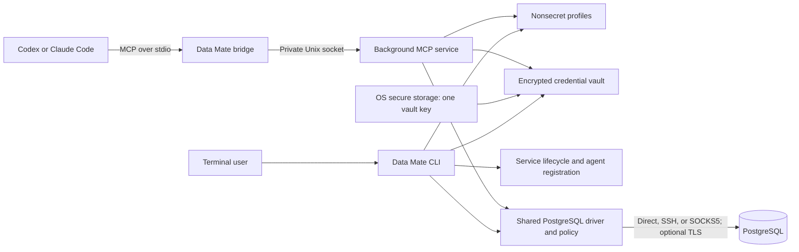

# Data Mate — Technical Design

## 1. Purpose and scope

Data Mate makes saved database connections available to independently launched terminal agents through a local, read-only MCP service. Users manage connections and visibility in the terminal; agents discover database structure and query permitted data without receiving connection credentials.

This document describes the current architecture and technical contracts. The [PRD](PRD.md) defines product requirements, the [README](../README.md) documents setup and usage, and the [changelog](../CHANGELOG.md) records user-visible changes. Implementation plans and validation evidence belong in ignored `.misc`, not in this design.

The supported platform is macOS on Apple Silicon, with one Go executable installed in the checkout's `.dev`. Agent adapters support Codex and Claude Code. PostgreSQL is the only database driver: connection and role checks require PostgreSQL 16 or later, while query compilation and diagnostic policy readiness require the reviewed semantic manifests supplied for majors 16 and 18. Other majors fail those semantic checks. PostgreSQL 16 and 18 form the integration matrix.

Other database drivers, Linux, distribution, automatic updates, credential export, and key rotation are deferred. Windows and Intel macOS are outside the product scope. `upgrade` and `update` are informational local-rebuild stubs. There is no GUI, cloud service, account system, model API integration, agent launcher, database mutation tool, migration runner, query history, telemetry, plugin loader, or local SQL database for application state. Data Mate does not manage database users or change server permissions.

The design follows these principles:

- One background service per installation shares database and policy logic across agents.
- Nonsecret profiles and encrypted credentials are separate; one installation key lives in OS secure storage.
- Every database request enforces saved visibility, role privileges, and supported semantics, including metadata requests.
- Resources, cancellation, ownership, and partial failures have explicit bounds and outcomes.
- The normal workflow is add a connection, optionally narrow scope, start MCP, and launch an agent normally.

## 2. Architecture



The binary has three process roles:

| Role             | Responsibility                                                                                              |
| ---------------- | ----------------------------------------------------------------------------------------------------------- |
| User CLI         | Forms, profile mutations, diagnostics, scope browsing, agent registration, and service lifecycle            |
| Internal service | MCP sessions, current profile snapshots, credential access, request admission, and shared driver operations |
| Internal bridge  | Relay bounded MCP messages between agent stdio and the service socket                                       |

Agent registration invokes `data-mate mcp bridge --root <absolute-root>`. A private service entry point runs under launchd. These internal commands require no separate user setup. The bridge has no database connection, vault key, or profile mutation API. Each bridge creates one socket connection and an independent MCP session. Stdout carries protocol messages only; diagnostics use stderr.

The service listens on a Unix domain socket in an owner-checked private directory. Directory/socket permissions and native peer UID/PID checks authenticate local peers before MCP begins. A bounded identity preamble precedes the SDK transport; agents see only MCP messages. The service uses the pinned Go MCP SDK for initialized protocol handling, tool dispatch, cancellation, and session shutdown.

### Package boundaries

| Location                                            | Responsibility                                                                 |
| --------------------------------------------------- | ------------------------------------------------------------------------------ |
| `cmd/data-mate`, `internal/cli`                     | Entry point, commands, forms, output, and exit contracts                       |
| `internal/config`                                   | Profiles, canonical revisions, paths, ownership, locks, and atomic persistence |
| `internal/contracts`                                | Strict public JSON schemas, decoding, examples, and safe error codes           |
| `internal/vault`                                    | Encrypted repository, write accounting, and native Keychain provider           |
| `internal/database`                                 | Shared driver operations and result/access types                               |
| `internal/database/postgres`                        | Connections, pools, catalogs, role checks, execution, and codecs               |
| `internal/database/postgres/sqlpolicy`              | Bounded parser, typed compiler, and embedded semantic manifests                |
| `internal/transport`                                | Direct, TLS, SSH, and SOCKS5 connection paths and owned SSH host pins          |
| `internal/service`                                  | Lifecycle, identity, runtime socket, profile reload, and request coordination  |
| `internal/mcp`                                      | Tool handlers, session framing/admission, and stdio bridge                     |
| `internal/agent`                                    | Client detection, registration inspection, and ownership-safe mutation         |
| `internal/devtools`, `scripts`, `.github/workflows` | Developer commands, regression harnesses, and CI                               |

Concrete packages implement most behavior. Interfaces represent external seams: the database driver, key provider, lifecycle/client operations, and dialing. `database.Driver` supplies validation, diagnostics, table listing, description, query execution, invalidation, and close. PostgreSQL also supplies the CLI catalog-browsing operation. Callers hold the profile state lease until driver cleanup and result preparation finish. Credentials travel only through private in-memory access snapshots.

Agent adapters own compatibility and registration, not database policy. Scope and query semantics remain driver-aware. Additional drivers must satisfy the credential, visibility, cancellation, and read-only contracts; there is no universal query language or dynamic plugin framework.

Dependencies are pinned in [go.mod](../go.mod) and `go.sum`: Cobra for commands, Huh and terminal helpers for forms, the official Go MCP SDK, pgx, `pg_query_go`, and Go SSH/network packages. JSON, filesystem operations, cryptography, and process primitives use the standard library where suitable. The native PostgreSQL parser and Keychain adapter require cgo and the macOS SDK.

## 3. CLI contract

During development, `make dev ARGS="..."` invokes the installed binary with the checkout's absolute `.dev` root.

| Command                              | Behavior                                                                            |
| ------------------------------------ | ----------------------------------------------------------------------------------- |
| `db add [options]`                   | Collect a connection, preview nonsecret settings, confirm, and save                 |
| `db edit [alias]`                    | Select a connection when omitted; edit, preview, confirm, and save                  |
| `db scope [alias]`                   | Select a connection when omitted; replace visible schemas/tables after confirmation |
| `db remove [alias]`, `db rm [alias]` | Confirm removal of a profile and its credentials                                    |
| `db list`, `db ls`                   | Show aliases, driver, endpoint, database, and scope                                 |
| `db test [alias]`                    | Diagnose one connection, or all in alias order when omitted                         |
| `mcp start`                          | Start or reuse the service, then ensure supported-agent registrations               |
| `mcp stop`                           | Stop the service and sessions; preserve profiles and registrations                  |
| `mcp status`                         | Passively report service and supported-agent registration states                    |
| `upgrade`, `update`                  | Explain local rebuilding without a network request                                  |
| `help`, `version`                    | Show usage or build version                                                         |

Saving profiles neither starts the service nor registers agents. A running service reads profile changes on subsequent operations. There is no activation command, login, or per-agent grant workflow.

### 3.1 Forms and credential input

The basic add form asks for driver, alias, host, port, database, username, and password, in that order. PostgreSQL and port 5432 are defaults. Username remains visible; secret input is hidden. Advanced flags enable their corresponding transport fields. Aliases are unique and editable; stable connection IDs survive renames.

Previews show only nonsecret settings and whether a secret is configured or changing. Blank edit fields preserve existing values; keeping and clearing a secret are separate actions. Confirmations default to No. Ctrl-C or negative confirmation exits 130 without publishing state. Omitted edit/remove aliases use selection by number or exact alias.

Listing and previews use descriptor-checked read-only access without initializing state or accessing Keychain. After confirmation, terminal modes are restored before the store opens. The writer compares the preview revision with the current profile revision; a stale preview requires a fresh review. Invalid configuration remains untouched. Normal saves do not test a connection; explicit SSH enrollment is the only save-time network probe.

Scripts supply complete required fields and `--yes`. Non-TTY commands report missing input rather than prompt. Add requires explicit password input or `--passwordless`. Secret input modes are mutually exclusive and cannot also drive a form:

| Input                 | Contract                                                                                                                    |
| --------------------- | --------------------------------------------------------------------------------------------------------------------------- |
| `--password-stdin`    | One UTF-8 password line; remove only one terminal LF or CRLF, preserving other whitespace                                   |
| `--credentials-stdin` | One strict bounded JSON object with optional `password`, `ssh_password`, `ssh_key_passphrase`, and `proxy_password` strings |

Both modes require `--yes`; each secret is limited to 128 KiB. Secrets are never accepted as command-line values or in credential-bearing URLs. The [credential input schema](../internal/contracts/schemas/credentials-input.json) defines the JSON object.

Omitted edit secrets remain unchanged. `--clear-password`, `--clear-ssh-password`, `--clear-ssh-key-passphrase`, and `--clear-proxy-password` clear individual secrets. `--clear-ssh` and `--clear-proxy` clear both transport settings and their secrets. SSH key files are imported once into the encrypted bundle; their source files remain untouched. A missing bundle can be repaired by explicitly supplying credentials for all configured transports. Missing keys or corrupt vault accounting are never silently recreated.

Advanced options include `--tls`, `--tls-ca`, `--ssh-host`, `--ssh-port`, `--ssh-user`, `--ssh-key-file`, `--ssh-enroll`, `--proxy`, and `--proxy-user`. TLS, SSH, and SOCKS5 are off by default. `--tls=false` clears the CA path; enabling TLS preserves an omitted existing CA field. Transport rules are specified in section 8. Limits use `--query-timeout` in whole milliseconds from `1ms` to `30s`, `--max-rows`, and `--max-result-bytes`.

A durably removed profile whose credential cleanup fails produces exit 1 and a partial-outcome diagnostic. Later confirmed profile mutations retry orphan reconciliation.

### 3.2 Scope selection

Add, edit, and scope commands accept `--all`, `--none`, repeated `--schema`, repeated `--table schema.table`, or `--scope-json`. Schema and table selections can be combined; all/none/JSON are mutually exclusive with those selections. Structured JSON preserves identifiers containing dots or other ambiguous characters. Scripted replacement performs no catalog fetch or credential access for the scope operation.

Interactive `db scope` browses the role's accessible application catalog independently of saved scope. Up/Down navigates, Right expands a schema, Left returns to schemas, Space toggles, `/` searches, `n` advances, and `b` restarts pagination. `a` selects all and `0` clears the selection. Enter previews the result before a final default-No confirmation. Whole-schema selection includes current and future tables. To narrow an all/schema selection, clear that broad selection before choosing individual tables.

Each fetch retains at most 50 schemas or tables and performs literal case-insensitive search at the current level. Selections absent from the current page remain intact. Search is bounded to 256 bytes; interactive selections are bounded to 4096 schemas/tables and half the profile byte budget. Catalog browsing never authorizes a query.

Each fetch opens a fresh shared state lease, verifies the preview revision, and reads credentials and host pins under that lease. Database cleanup finishes before lease release; human input holds no lease. Final scope publication uses an exclusive lease and revision comparison without vault access or orphan reconciliation. Browsing opens existing state without initialization or migration. For manually written profiles in a fresh root, `db test` or a confirmed `db edit` initializes state before browsing; scripted scope replacement needs no catalog access.

### 3.3 Diagnostics and output

`db test` runs selected profiles sequentially in alias order with a per-profile deadline that includes lease acquisition and vault access. Each result records reached `config`, `vault`, `dial`, `authentication`, `version`, and `policy` stages. Dial includes the route and TLS handshake; an observed PostgreSQL authentication exchange distinguishes authentication failures. Policy uses the same role and semantic-catalog checks as the query path, without compiling agent SQL or reading application rows. Successful diagnostics do not authorize later queries.

The terminal `stage` and `ok` fields summarize each result. A failed stage includes a safe error object; later stages are omitted. Ordinary per-profile failures continue the batch. Invalid whole-document configuration and unknown aliases fail before output because no validated selection exists. Cancellation stops the command. Output occurs after releasing state leases. Diagnostics may initialize owned state for manual profiles but do not create or repair secrets, keys, or database grants.

Human previews honor `NO_COLOR`; machine output has no color. `db list`, `db test`, and all three public MCP lifecycle commands support `--json`. Their version-1 envelopes contain `connections`, `results`, or service `state`/`agents`; exact contracts live in [schemas](../internal/contracts/schemas). Diagnostics use stderr. Exit codes are 0 for success, 1 for operational failure, 2 for invalid usage/configuration, and 130 for cancellation. A test batch exits nonzero if any profile fails.

## 4. Agent integration and service lifecycle

### 4.1 Registration and ownership

`mcp start` ensures a user-level stdio registration for each installed supported client after service readiness. Each adapter detects its client, inspects existing configuration, adds an absent entry, and verifies the result. Client writes use argument arrays with no shell interpolation:

```text
codex mcp add <registration-name> -- <absolute-binary> mcp bridge --root <absolute-root>
claude mcp add --transport stdio --scope user <registration-name> -- <absolute-binary> mcp bridge --root <absolute-root>
```

The registration name is `data-mate-dev-<root-hash>`, using the first 16 hexadecimal characters of the canonical root digest. Absolute binary/root paths isolate checkouts. Start output identifies the registration and root. New agent sessions load the registration; existing sessions may need their normal reconnect or restart. Native approval, trust, sandbox, managed policy, and project overrides remain the client's responsibility.

Inspection reads Codex TOML and Claude user-scope JSON directly, without invoking client health checks. Codex uses `$CODEX_HOME/config.toml` or `~/.codex/config.toml`; Claude uses `$CLAUDE_CONFIG_DIR/.claude.json` or `~/.claude.json`. Overrides must be absolute. Reads are capped at 4 MiB and reject unsafe files, duplicate keys, and unsupported layouts. Only absolute PATH directories participate in detection and child PATH. Registration subprocesses run from `/` with eight-second and 64-KiB output bounds; their output is discarded.

`state/registrations.json` binds its version, installation UUID, full root/digest, client/config location, name, expected command/arguments, canonical entry fingerprint, and intent/owned phase. Add intent is durable before the client write. A retry reconciles an interrupted add only when the entry matches exactly. Matching unrecorded entries are usable without granting deletion authority. Removal requires recorded ownership and an unchanged fingerprint. A relocated config override or unrelated same-name entry is a conflict.

Configuration is inspected immediately before and after client writes; unrelated values must remain unchanged. External client edits are not transactionally locked by Data Mate. Observed changes produce a conflict, and Data Mate does not overwrite user changes through wholesale rollback.

Agent states are `unavailable`, `pending`, `ready`, `disabled`, `conflict`, and `failed`. Ready means the user registration matches, not that session policy grants access. Codex's disabled flag is preserved and reported. Missing clients are skipped and do not block service startup. Adapter failures exit 1 while retaining the healthy service and successful registrations, making another start a safe retry. Passive status reads ownership and client configuration without repair; invalid/unreadable metadata exits 2.

### 4.2 Start, stop, and status

The lifecycle manager uses one job in the current user's GUI launchd domain. Its generated plist lives beneath the installation root. `mcp start` explicitly bootstraps the job; there is no login item. `RunAtLoad=true` applies to that bootstrap, `KeepAlive=false` disables crash restart, and `ExitTimeOut=5` delegates forced termination to the verified job.

Start serializes these operations under the lifecycle lock:

1. Validate installation ownership, profiles, executable identity, and owned runtime state.
2. Reuse a healthy matching service or clean up only verified stale resources.
3. Start the service and wait up to 30 seconds for readiness. The service validates existing vault contents and may require native Keychain authorization; denial or timeout fails startup.
4. Ensure agent registrations, then report service and independent per-agent results.

An empty installation starts with zero connections without creating a vault/key. Database connections open lazily, so an unreachable database does not prevent readiness. Invalid profiles or an unreadable existing vault do. Startup failures attempt cleanup of the partial owned job.

Stop terminates the verified launchd job. The service rejects new work, cancels active operations, and closes sessions, pools, and transports. The launchd adapter verifies the exact plist path and ProgramArguments from bounded inspection output before bootout; unknown layouts fail closed. It waits for job removal before unlinking owned runtime state. A PID file alone never authorizes signaling a process. Stop is idempotent and preserves profiles, credentials, and registrations. Bridges never start or restart the service.

Status checks launchd, runtime identity/readiness, profile validity, and registration metadata. It does not connect to databases, retrieve secrets, unlock Keychain, start processes, or repair configuration. Service states are `stopped`, `starting`, `running`, `degraded`, and `stale`. Invalid reloaded configuration degrades a running service and blocks database work. Stopped is a successful query; invalid configuration/state exits 2 and other inspection failures exit 1. Status still emits the requested report alongside stderr diagnostics on failure.

### 4.3 Runtime identity and handshake

Service state binds the full installation identity, internal protocol version, instance nonce, application version/revision, executable SHA-256, and observed PID. A byte-changing rebuild requires restart even if version/revision are unchanged. Incompatible bridges and CLI probes report the mismatch instead of relaying uncertain protocol messages.

The preamble is a four-byte big-endian length followed by strict JSON, capped at 4 KiB before body allocation. Both peers check native UID/PID and the full identity/nonce. The private socket is `/private/tmp/dm-<uid>-<root-suffix>/s`, with an independent full-identity marker. The directory is mode 0700; marker and socket are mode 0600. Short runtime paths support long installation paths and spaces; service roots containing control characters are rejected. Cleanup preserves unrelated runtime entries.

Daemon streams go to `/dev/null`; the service creates no persistent log. Callers receive bounded safe readiness diagnostics.

## 5. Persistent data and configuration

### 5.1 Installation layout and ownership

```text
.dev/
  bin/data-mate
  config/connections.json
  config/known_hosts          # Enrolled SSH host pins, when present
  state/installation.json
  state/state.lock
  state/state-gate.lock
  state/lifecycle.lock
  state/vault.json            # Encrypted credentials, when present
  state/vault-usage.json      # Durable encryption accounting
  state/registrations.json
  state/service.plist
  state/service.json
  state/purge.json            # Terminal receipt during interrupted purge
```

Files are created when their owning operation needs them. Install/build initialize the nonsecret identity, empty profiles, and stable locks without creating a vault/key, service job, or registration. Directories are mode 0700; profile, vault, and state files are mode 0600.

The installation identity records its UUID, full root digest, established-profile state, purge tombstone, and exact owned paths, including fixed `.tmp` publication siblings. Only the corresponding exclusive writer can recover an interrupted sibling; unknown files remain untouched. Owned files are accessed through descriptor-based ownership and symlink checks before mutation or cleanup. Recognized historical inventories migrate under lifecycle locking without changing installation identity.

The installed binary resolves its canonical root from its executable location or an explicit absolute `--root`, independently of the caller's working directory. Agent registrations pin that root. Installations never fall back to shared user configuration or another checkout's Keychain namespace. No distributed installation layout is provided.

### 5.2 Profile schema and revisions

The executable contract is [profiles.json](../internal/contracts/schemas/profiles.json). A profile contains only nonsecret connection, transport, visibility, and limit settings:

```json
{
  "version": 1,
  "connections": [
    {
      "id": "936e3468-5b48-4ef2-9a89-964449f06d98",
      "alias": "analytics",
      "driver": "postgres",
      "connection": {
        "host": "127.0.0.1",
        "port": 5432,
        "database": "analytics",
        "username": "analytics_reader"
      },
      "credential_ref": "4a43b349-904a-49b7-8395-7af73d613165",
      "transport": { "tls": { "mode": "disabled" } },
      "scope": { "mode": "all" }
    }
  ]
}
```

`credential_ref` addresses an encrypted bundle, never a Keychain item. It may be omitted when the connection needs no managed credentials. Manual profiles use the same contract as CLI-created profiles and require no activation record. A nonexistent bundle returns `CREDENTIAL_MISSING`; `db edit` can attach credentials. File configuration alone cannot create a secret.

Strict decoding rejects unknown fields/versions, recursive duplicate keys, trailing values, invalid UTF-8, duplicate IDs/aliases/credential references, invalid ports, and embedded secret fields. Profiles are bounded to 1 MiB and 128 connections. Aliases match `^[a-z][a-z0-9_-]{0,62}$`. UUID comparisons normalize case; scope names preserve it. The PostgreSQL connection object accepts explicit fields, with no DSN or unrestricted option-string passthrough.

Transport objects contain TLS `{mode:"disabled"|"verify-full",ca_file?:absolute-path}`, optional SSH `{host,port,user,auth:"password"|"key"}`, or optional SOCKS5 `{kind:"socks5",host,port,username?}`. Authentication material stays in the vault. CA files require verified TLS; SSH and SOCKS5 are mutually exclusive. Missing scope is invalid; profile creation explicitly chooses all.

| Optional limit     | Default | Accepted range |
| ------------------ | ------- | -------------- |
| `query_timeout_ms` | 10000   | 1–30000        |
| `max_rows`         | 500     | 1–5000         |
| `max_result_bytes` | 1048576 | 1024–1048576   |

Omitted members take individual defaults; zero is not omission. Revisions are SHA-256 over validated canonical JSON with normalized UUIDs, explicit defaults, and sorted profiles/scope selections. Formatting and selection order do not change a revision; settings and limits do.

### 5.3 Locking, publication, and reload

Stable OS lock files coordinate processes; replaceable data-file inodes are never the lock authority. Lock order is lifecycle, admission gate, then state. Lifecycle locking serializes initialization, start/stop, executable publication, and the complete uninstall coordinator. Readers briefly hold the exclusive admission gate while acquiring a shared state lease; writers retain it through exclusive state access. A process-local writer-preferring queue supplements independently opened flock descriptors. Acquisition is context-bounded, and acquired leases recheck named lock inodes and installation identity so stale waiters cannot mutate a recreated root.

Database requests hold shared state access from profile validation through execution, cleanup, and bounded response preparation. CLI mutations take exclusive access and compare the preview revision. Once a change command succeeds, no operation using the previous configuration remains active. Socket output occurs after lease release.

All changes validate before publication, using same-directory atomic replacement, file sync, and parent-directory sync. Credential changes follow this order under the exclusive state lease:

1. Allocate a fresh credential reference and durably publish its encrypted bundle.
2. Publish the profile referencing that bundle.
3. Remove unreferenced bundles.

Removal publishes profile deletion before bundle cleanup. Interrupted operations may leave encrypted unreachable bundles, but never a new profile referencing an uncommitted bundle. Confirmed profile mutations reconcile orphans. Cleanup failure is reported separately from a durable profile change; no plaintext journal is created.

The service admits work before reading its profile snapshot, so queued callers hold no old configuration. Each operation revalidates current bytes. Changed profiles invalidate their pools, transports, and cursors; private pool fingerprints also include credentials and host pins. Invalid configuration blocks operations instead of retaining a broader last-known-good scope. Live catalog and grant results are never cached. Manual editors should use atomic replacement, but do not participate in application locking: an already accepted request can finish under its snapshot; subsequent requests validate the new file.

## 6. Centralized credential vault

### 6.1 Encryption and accounting

One encrypted vault stores all managed database passwords, SSH private keys/passphrases, and proxy passwords. One random 256-bit AES key lives in macOS Keychain per installation, independent of the number of connections. The generic-password item uses a fixed application service and an account derived from the canonical root.

The provider uses native Keychain APIs and the file-based default Keychain for checkout-local executables. Exact service/account queries and native item-reference deletion preserve ownership across binary changes. Interaction control is serialized and restored around each call. OS prompts are synchronous; a changed executable may require fresh approval, and denial never authorizes replacing the item. Keys never pass through the `security` CLI, subprocess output, environment variables, or files.

The encrypted envelope is versioned:

```json
{
  "version": 1,
  "vault_id": "d5c44511-2435-45cb-b3ee-cbf999ae24e1",
  "cipher": "AES-256-GCM",
  "write_sequence": 1,
  "nonce": "<base64>",
  "ciphertext": "<base64 ciphertext including authentication tag>"
}
```

The plaintext is a versioned map from credential references to connection IDs and secret fields. Each mutation encrypts the complete document using Go's AES-GCM implementation, a fresh random 96-bit nonce, and the full authentication tag. Length-prefixed associated data binds format version, cipher, vault ID, full root digest, installation UUID, and write sequence.

The envelope is bounded to 8 MiB, decrypted content to 4 MiB, and each secret/imported key to 128 KiB. Strict decoding rejects duplicate keys, unknown fields/versions, null or missing required fields, and invalid identities. Bundle lookup verifies the connection-ID binding against a fresh profile under the active state lease.

`state/vault-usage.json` records version, installation UUID, root digest, key fingerprint, and reserved encryption count. The ledger is durable before Keychain create-if-absent. Each write reserves and syncs the next count before generating its nonce and encrypting; failed publication consumes the reservation. The authenticated envelope sequence cannot exceed the ledger. A key permits at most one million writes; there is no automatic rotation or counter reset.

Removing the last connection preserves accounting. A key without accounting, a mismatched key, or a vault without a key requires repair. An unused ledger with neither key nor vault can be reinitialized. This protects interruption recovery, not rollback by an actor able to restore both files; restoring old accounting snapshots is unsupported.

### 6.2 Secret lifecycle and exposure

The first credential save creates the key and vault under exclusive state access. A failed vault publication may leave an unused key that a retry reuses. An existing vault never triggers automatic replacement of a missing key or reset of its contents.

At startup the service loads the key when a vault exists and retains it for the process lifetime. CLI credential operations load it as needed. Bundles are decrypted at use; active connections retain the credentials they require. Profile changes and shutdown retire affected resources. Mutable buffers are cleared where practical, but Go memory management cannot guarantee complete secret erasure.

Locked/unavailable Keychain, denied access, authentication failure, corrupt accounting, or unknown formats produce safe errors and preserve existing data. There is no plaintext fallback. Nonsecret listing and passive status remain available. Password replacement uses a new bundle reference; alias changes preserve connection identity. Removing a profile removes its bundle, while the installation key may remain. Explicit purge removes the vault and exact owned key.

Copying a vault does not provision its key or namespace. The supported transfer workflow copies nonsecret profiles and re-enters credentials. Deletion cannot erase external backups or guarantee physical erasure.

Credentials and keys never appear in agent settings, MCP results, previews, diagnostics, command-line arguments, or Data Mate-created plaintext files. Imported SSH source files are not modified. Upstream errors are translated rather than logged verbatim. The vault protects secrets at rest and the MCP interface; it does not isolate arbitrary code running as the same OS user, a compromised service, or a hostile database server. Approved database results are intentionally visible to agents and subject to the agent's own data handling.

## 7. Visibility policy

Each profile addresses one database. Effective visibility intersects configured scope, the database role's privileges, and driver-supported objects. All scope does not grant missing privileges or bypass query validation.

| Scope                                                                                        | Meaning                                                                                |
| -------------------------------------------------------------------------------------------- | -------------------------------------------------------------------------------------- |
| `{"mode":"all"}`                                                                             | All accessible application schemas/tables, including future ones; the creation default |
| `{"mode":"selected","schemas":["reporting"],"tables":[{"schema":"public","name":"orders"}]}` | All tables in `reporting` plus `public.orders`                                         |
| `{"mode":"selected","schemas":[],"tables":[]}`                                               | No visible objects                                                                     |

Selected schemas and tables form a union of exact, case-preserving names. There are no patterns or exclusions. Future tables enter through all or whole-schema selection. Renamed/missing explicit names remain unavailable; recreating a selected name selects the replacement object. Scope is name-based.

Agent catalog tools apply saved scope and role privileges in trusted parameterized SQL before C-collated keyset pagination. The user's scope picker can inspect the role's full accessible application catalog. Metadata omits full definitions, default expressions, role listings, server paths, credential references, and hidden foreign-key endpoints. Catalog support labels describe discovered objects but do not authorize execution.

Queries support ordinary and partitioned application tables with audited built-in types and execution features. Views, materialized views, foreign tables, temporary/system relations, custom types/functions/operators, and unverified relation features are unsupported. Ordinary inheritance requires every scanned descendant to be in scope. Selecting a partition root includes its partitions, subject to grants and driver support. Execution freezes and rechecks the hierarchy; hierarchies with RLS are unsupported.

Authenticated cursors bind version, profile ID/revision, schema filter, position, and process invalidation epoch. Tokens are at most 2 KiB and expire on restart or invalidation. Agent pages default to 100 and cap at 500 objects. Descriptions cap columns at 1600 and hierarchy/constraint materialization at 4096 entries, with operation deadlines and conservative encoded-size accounting. Metadata shares the profile result-byte cap.

## 8. Database transport and connection management

### 8.1 Explicit transport paths

| Route/protection | Behavior                                                                                              |
| ---------------- | ----------------------------------------------------------------------------------------------------- |
| Direct           | TCP to the configured database host/port                                                              |
| TLS              | Off by default; verified certificates and database hostname using system roots or an explicit CA file |
| SSH              | One explicit jump host, password or imported-key authentication, and exact owned host pins            |
| SOCKS5           | Explicit endpoint, optionally authenticated with vault credentials                                    |

TLS can layer over any route. Failure never falls back to plaintext or direct access, and there is no skip-verification setting. Previews disclose disabled TLS, including a note for non-loopback endpoints. SSH and SOCKS5 are mutually exclusive. Database hostnames resolve at the selected jump host/proxy, while TLS still verifies the original database hostname. Cancellation connections retain the original database endpoint.

Connection configuration uses explicit profile/vault values. Startup removes inherited `PG*` variables before application goroutines; a missed sanitation fails closed. The initialized pgx template uses explicit placeholders and `/dev/null` password/service files, then validated settings and an allowlisted session configuration. Only TCP hostnames/IPs are accepted. No ambient SSH agent/configuration, proxy environment, password/service file, or helper process supplies fallback behavior.

SSH enrollment uses interactive `db add/edit --ssh-enroll`: a TTY, explicit SHA-256 fingerprint confirmation, and final default-No profile confirmation are required. `--yes` and stdin credential modes cannot enroll. The probe sends no authentication material. The candidate stays in memory until the confirmed writer rechecks revision and current pin, then atomically publishes mode-0600 `config/known_hosts` before the profile. Cancellation publishes nothing; a later save failure may leave an unused owned pin.

The known-host file is bounded to 1 MiB and accepts exact endpoint public-key entries only. Duplicate endpoints, wildcards, certificates, and markers are rejected. Unknown/changed keys fail at runtime, and enrollment cannot overwrite a changed pin. Background operations cannot enroll hosts.

Each database connection owns its SSH TCP connection and forwarding channel, or its SOCKS5 socket. Closing the database connection closes its route. SSH deadlines dispose the entire route, including writes blocked on channel credit. Connection setup is bounded to ten seconds and honors earlier cancellation. SOCKS5 username/password fields have a 255-byte protocol bound. Credential and pin snapshots are read under the caller's state lease; changes retire pools through private access fingerprints.

### 8.2 Pools, admission, and cleanup

One shared PostgreSQL driver owns lazy pools with no initial idle connections, at most two connections per profile, at most sixteen pools, and five-minute idle eviction. Driver admission allows eight active operations, 32 waiters, and a five-second queue deadline. The service manager separately applies the same admission bounds before acquiring state access. Service database work has a 35-second outer deadline and then the profile timeout; connection listing has a five-second deadline.

Queries, catalog operations, and diagnostics use the same connection boundary: a read-only READ COMMITTED transaction with fresh role-readiness checks. Pools cache connections, never live catalog/grant authorization. PostgreSQL statement and description caches are disabled. Profile invalidation cancels active work and invalidates cursors.

Rollback has an independent two-second budget. Uncertain connections are discarded; cleanup failure cannot return success. Deliberate byte truncation closes the connection before returning a complete bounded result instead of draining unread rows. No executing query is automatically retried. Driver cleanup finishes before the caller releases its state lease.

Every PostgreSQL connection, including readiness and catalog connections, caps message bodies at 2 MiB. A constant-memory frame-length observer preserves `RESOURCE_LIMIT` when pgx would otherwise report only a closed connection; it retains no message data.

## 9. Read-only PostgreSQL execution

Read-only enforcement combines role restrictions, saved scope, a finite typed SQL subset, fresh catalog verification, relation locking, and read-only transactions. A SELECT prefix, volatility label, or transaction access mode alone is insufficient.

### 9.1 Role and server trust boundary

The configured role needs CONNECT, schema USAGE, and SELECT on intended objects. Checks reject superuser, BYPASSRLS, role/database creation, replication, membership ADMIN options, application database/schema/object ownership, schema creation, relation/column writes, sequence USAGE/UPDATE, and privileged server file/program capabilities. PostgreSQL 17+ MAINTAIN is also rejected. Both inherited and SET-reachable capabilities are evaluated, including mixed membership paths and PUBLIC grants.

Readiness checks cover application objects throughout the database, not just saved scope. TEMP alone is permitted, but query execution rejects temporary relations. Data Mate never grants or revokes privileges.

Ordinary noninherited RLS executes under the configured role. Owners and BYPASSRLS roles are unsuitable. RLS functions and administrator-controlled server code remain trusted configuration; Data Mate cannot prove arbitrary server code harmless or freeze administrative grant changes. RLS hierarchies are rejected.

### 9.2 Compiler and accepted subset

The [compiler contract](../internal/database/postgres/sqlpolicy/README.md) defines exact syntax, budgets, semantic fields, and manifest maintenance. Independent lexical bounds precede the pinned `pg_query_go` parser. Strict populated-field checks and typed AST validation default to rejection. Original agent SQL is never sent to PostgreSQL for planning or execution; the compiler emits canonical SQL and separately bound values with explicit OIDs.

The supported subset includes one SELECT, schema-qualified physical relations, aliases and column aliases, projections/stars, typed literals/parameters, INNER/LEFT/RIGHT/FULL/CROSS joins with ON, supported boolean/comparison/numeric expressions, NULL predicates, BETWEEN, finite IN lists, noncorrelated EXISTS/IN subqueries, derived SELECTs, nonrecursive CTEs, simple GROUP BY/HAVING, count/sum/avg/min/max, supported aggregate DISTINCT arguments, ordering, and integer LIMIT/OFFSET. CTEs and aliases resolve through lexical scopes. Duplicate output labels are preserved through unique internal bindings.

Unknown strings/NULL need contextual or explicit types. Numeric casts and int2 → int4 → int8 → numeric widening use audited signatures. Comparisons, grouping, ordering, and aggregate overloads require exact supported built-in semantics. Default/C/POSIX collations and plain audited built-in btree indexes are supported.

Unsupported constructs include multiple statements, data-modifying CTEs, SELECT INTO, locking clauses, DDL/DML, COPY, CALL, DO, transaction/session/role commands, prepared-statement execution, EXPLAIN, direct system-catalog access, user-defined functions/operators, set-returning functions, SELECT DISTINCT, correlated/lateral queries, set operations, arrays, windows, grouping aliases/ordinals, ambiguous output-alias ordering, explicit CTE materialization, type modifiers, and quoted backslash escapes. Custom/expression/partial/non-btree indexes and unaudited coercions fail closed. Explicit expressions, unambiguous ordering ordinals, and typed parameters provide supported alternatives where applicable.

Session `search_path` is `pg_catalog`; physical relations require explicit schemas. Embedded manifests for PostgreSQL 16 and 18 define supported types, I/O functions, operators, casts, aggregates, btree semantics, and referenced implementation/planner callbacks. Each immutable manifest is validated and indexed once. Live definitions are fetched and verified on every compilation and again after relation locking. Comparison uses semantic identity, allowing only the incidental row OIDs and numeric planner estimates documented in the compiler contract. Unsupported majors or changed definitions return `QUERY_UNSUPPORTED`. Presence in a manifest does not make a function callable by agent SQL.

### 9.3 Execution sequence

Each query follows this sequence:

1. Admit work, validate the current profile, and read scope/credentials under shared state access.
2. Validate parameter codecs and bounded SQL structure before acquiring a pool connection.
3. Begin a read-only READ COMMITTED transaction, set local statement/lock timeouts, and check role readiness.
4. Verify live semantic definitions and compile against current relation identities, grants, scope, columns, and hierarchy.
5. Lock captured relation names with `LOCK TABLE ONLY ... IN ACCESS SHARE MODE` in OID order. Recheck role, identities, complete column layouts, hierarchy edges, grants, and scope with fresh snapshots; reverify semantic definitions even for relation-free SELECTs. Changed captures fail with retry guidance.
6. Execute emitted SQL and separate parameters through the extended query protocol. Validate returned column names/OIDs/formats against the plan and consume raw text values incrementally.
7. Finish bounded result preparation and rollback, or discard a deliberately truncated/uncertain connection, before releasing database and state resources.

Hierarchy scans emit explicit ONLY relations and UNION ALL, including typed empty partition roots. Attachments made after the final check cannot enter the captured physical scans; later requests rediscover them. A compiled plan never authorizes execution outside the lock/recheck sequence, and successful authorization is not reused across requests.

### 9.4 Bounds and value codecs

| Resource                        | Bound                                                        |
| ------------------------------- | ------------------------------------------------------------ |
| Query timeout                   | Profile default 10 seconds, maximum 30 seconds               |
| Relation lock wait              | 1 second                                                     |
| Returned rows                   | Profile default 500, maximum 5000; caller may lower          |
| Result envelope                 | Profile cap, at most 1 MiB                                   |
| Input SQL                       | 64 KiB                                                       |
| Lexical tokens / AST messages   | 8192 each; depth 64                                          |
| Supplied parameters             | 256; 64 KiB each, 256 KiB total before/after wire conversion |
| Generated bindings              | 8192                                                         |
| Expression emission / final SQL | 1 MiB each                                                   |
| Compiler catalog                | 4096 relations, 8192 columns                                 |

Native parsing is size/depth bounded; Go context cancellation is not a guarantee that an in-progress native parser call can be interrupted. Regression checks isolate worst-case parsing in a deadline-controlled subprocess.

The emitter caps the top-level LIMIT at the effective row cap plus one lookahead row, preserving smaller user limits and nested pagination. Row/byte truncation returns complete rows with `truncated: true`, never broken JSON. Timeouts/cancellation return failures rather than presenting partial work as a complete result. Column metadata that cannot fit produces `RESOURCE_LIMIT`.

Byte accounting includes column metadata, JSON escaping, base64 expansion, maximum count/elapsed widths, structured content, and duplicated compact JSON compatibility text. `QueryPayloadSize` shares that tool-envelope definition with MCP. JSON-RPC framing has an independent cap.

Rows are arrays aligned with columns, preserving duplicate labels. SQL NULL is JSON null. Int8 and exact numeric values are strings; finite floats are numbers and special floats are strings. Local timestamps use `T` without a zone; timestamptz normalizes to UTC with `Z`. Infinity and BC values remain explicit strings. Bytea metadata always specifies `encoding:base64`, including for NULL. JSON remains structured with exact number and duplicate-member preservation, bounded to 1 MiB and depth 64.

Parameters use ordered `{type,value}` objects with canonical supported PostgreSQL scalar names and the same codec representations. Temporal parameters require ISO forms and explicit zones for timestamptz; audited PostgreSQL input functions validate calendar/range constraints. Codec/signature fixtures live in [PostgreSQL testdata](../internal/database/postgres/testdata/README.md).

## 10. MCP contract

### 10.1 Tools and results

Four tools expose strict embedded [input/output schemas](../internal/contracts/schemas):

| Tool               | Input                                                         | Output                                                                 |
| ------------------ | ------------------------------------------------------------- | ---------------------------------------------------------------------- |
| `list_connections` | Empty object                                                  | Aliases, drivers, database labels, and configured scope                |
| `list_tables`      | `connection`; optional `schema`, `cursor`, `page_size`        | Visible table names, kinds, support labels, and next cursor            |
| `describe_table`   | `connection`, `schema`, `table`                               | Columns, supported types, nullability, keys, and visible relationships |
| `query`            | `connection`, `sql`; optional typed `parameters`, `row_limit` | Columns, rows, row count, truncation, and elapsed time                 |

All tools declare read-only intent, enforced server-side. Inputs reject additional fields. No tool accepts connection overrides, credentials, DSNs, hosts, or arbitrary file paths; no tool modifies profiles or broadens scope. Schema validation alone does not authorize execution. Connection listing reads only the public profile snapshot and never loads credentials.

Each handler calls the shared service manager and prepares both `structuredContent` and identical compact JSON text under the state lease. The combined envelope must fit one MiB and the lower profile cap for database tools. Serialization/output after preparation holds no state lease. A session never caches successful live authorization.

Example structured query result:

```json
{
  "connection": "analytics",
  "columns": [{ "name": "order_count", "type": "int8" }],
  "rows": [["42"]],
  "row_count": 1,
  "truncated": false,
  "elapsed_ms": 8
}
```

Tool failures use `isError` and a safe `{code,message,retryable}` object. Codes include `CONFIG_INVALID`, `CONNECTION_NOT_FOUND`, `CREDENTIAL_MISSING`, `VAULT_UNAVAILABLE`, `CONNECT_FAILED`, `SCOPE_DENIED`, `QUERY_UNSUPPORTED`, `QUERY_TIMEOUT`, `RESOURCE_LIMIT`, `POLICY_UNSAFE`, `STALE_CURSOR`, `INVALID_ARGUMENT`, `SERVICE_UNAVAILABLE`, and `CANCELLED`. Unexpected internal failures become `SERVICE_UNAVAILABLE`; invalid tool arguments and protocol errors remain JSON-RPC errors. Raw DSNs, parameters, upstream PostgreSQL details/hints, and decrypted secrets never enter diagnostics.

Database text is untrusted data, not operational instruction. Scope controls retrieval; it cannot make permitted text immune to prompt injection in the consuming agent.

### 10.2 Sessions, framing, and cancellation

After the authenticated identity preamble, SDK IOTransport negotiates MCP `2025-11-25`. Stateless `server/discover` receives a protocol error so newer SDK clients can fall back to initialization. Subscriptions, sampling, prompts, and persistent resources are not exposed. Each socket owns an independent server session.

The listener caps handshakes plus sessions at sixteen. A pre-dispatch guard admits at most four concurrent requests per session, including control requests, and filters repeated/unknown cancellation IDs. Saturation closes the excess peer instead of creating an unbounded handler or response queue. Service/driver queue exhaustion returns typed tool errors.

Frames are complete newline-delimited JSON objects, bounded to 256 KiB inbound and 2 MiB outbound including wrapping/newline. Duplicate keys, excess nesting, batches, malformed frames, and work before initialization close the session. Initialization has a ten-second deadline; blocked socket/bridge output has five seconds.

The bridge owns and closes its streams. Cancellable file reads allow service disconnect to interrupt idle stdin. Inherited stdout uses a nonblocking duplicate registered with Go's poller; output without deadline support is refused. Normal stdin EOF ends the bridge successfully; unexpected service EOF is an operational failure. EOF/cancellation cancels session work. Protocol and upstream error details are neither logged nor copied into diagnostics.

## 11. Development operations and cleanup

### 11.1 Build and validation commands

`VERSION` is the sole checked-in application version. Build metadata may add revision and dirty-state information. The pinned toolchain in `go.mod` and `scripts/common.sh`, native cgo, and the macOS SDK are required. Dependency checks provide guidance rather than installing system software. Docker is needed only for explicit integration tests.

| Target                     | Contract                                                                                                       |
| -------------------------- | -------------------------------------------------------------------------------------------------------------- |
| `make setup`               | Prepare pinned dependencies/tools without building or creating `.dev`                                          |
| `make install`             | Prepare dependencies, build, and install `.dev/bin/data-mate`                                                  |
| `make build`               | Atomically rebuild the development executable without agent/credential changes                                 |
| `make dev ARGS="..."`      | Run the installed binary with this checkout's absolute root                                                    |
| `make format`, `make tidy` | Format Go and Bash; tidy is an alias                                                                           |
| `make format-check`        | Check formatting without writing files                                                                         |
| `make lint`                | Run go vet and pinned staticcheck                                                                              |
| `make test`                | Run isolated offline unit/regression tests                                                                     |
| `make test-race`           | Run the same suite with the race detector                                                                      |
| `make test-integration`    | Run owned PostgreSQL 16/18 Docker fixtures; excluded from CI                                                   |
| `make clean`               | Default uninstall with purge disabled, even if `PURGE=1` was supplied                                          |
| `make uninstall`           | Remove service, owned registrations, executable, and runtime artifacts; preserve configuration and credentials |
| `make uninstall PURGE=1`   | Also remove owned profiles, vault/accounting, exact key, host pins, and installation state                     |

`VERBOSE=1` enables Go download/build diagnostics for setup/install/build. Executable publication verifies the built sibling and atomically renames it under lifecycle locking. Purge tombstones block publication. Rebuilding an active service requires `mcp stop` followed by `mcp start`; its process image is not hot-swapped.

[AGENTS.md](../AGENTS.md) defines development and validation conventions; [CLAUDE.md](../CLAUDE.md) points to the same guide. Retained plans and evidence use ignored `.misc`; developer-managed `.tmp` is not application state.

### 11.2 Uninstall and purge

Cleanup uses exact inventory and verified ownership under an outer lifecycle lease. Default uninstall stops the verified job and runtime, removes unchanged owned agent registrations, drains state readers, and removes the executable. It preserves profiles, encrypted vault, usage ledger, Keychain item, SSH pins, installation identity, and stable locks for reinstall.

The Make wrapper builds a private helper under `/tmp` so cleanup/retry remains available after binary removal without publishing into an installation being purged. External cleanup failures preserve the binary and ownership metadata. Failures report a safe stage, remaining owned paths, and a retained helper retry command.

Explicit purge marks a durable tombstone before exact-key deletion, then removes profiles, vault, accounting, known hosts, and owned publication siblings. A terminal `state/purge.json` receipt preserves root/installation identity through final identity and lock removal. Startup/publication rejects that receipt; only cleanup can recreate missing terminal locks. Deleting the receipt commits terminal cleanup. All lock waiters recheck named inodes and identity.

Unrelated `.dev` contents, external agent settings, source keys, certificates, unrecognized logs/build files, and shared Go caches remain untouched. Directories are removed only when empty. Ownership is never inferred from a filename prefix. Semantic manifests are embedded in the executable; no installed manifest sidecar is needed.

## 12. Validation boundaries

Tests live beside the owning Go packages; reusable fixtures and public examples live in package-local `testdata`. The offline suite uses isolated roots, synthetic peers, and fake key providers. Native credentials, user agent configuration, and external databases require explicit opt-in. Detailed test-growth and validation rules live in [AGENTS.md](../AGENTS.md).

| Area                    | Contract coverage                                                                                                                                               |
| ----------------------- | --------------------------------------------------------------------------------------------------------------------------------------------------------------- |
| Configuration and vault | Strict decoding, manual profiles, revisions, preview races, publication order, tamper detection, write accounting, one-key ownership, and interruption recovery |
| CLI                     | Hidden input, cancellation, non-TTY behavior, scope selection, JSON/exit contracts, and multi-profile diagnostics                                               |
| Lifecycle and agents    | Independent checkouts, registration conflicts/preservation, start/stop, partial readiness, stale/rebuilt identities, and cleanup retries                        |
| MCP and resources       | Initialization, schemas, independent sessions, frame/queue limits, disconnect/cancellation, bounded output, and redaction                                       |
| PostgreSQL              | Accepted/rejected SQL, role/scope enforcement, semantic manifests, hierarchy/DDL races, codecs, truncation, rollback, and connection disposal                   |
| Ownership and purge     | Symlink/identity protection, state-reader draining, tombstones/receipts, exact-key deletion, and preservation of unrelated files                                |

Bounded fuzz seeds exercise decoding and SQL policy. Race tests cover concurrent behavior. CI uses `macos-15` jobs for Format and lint, Test and build, and Race tests, each with `make setup`; Docker integration is excluded.

`make test-integration DB_DRIVER=postgres` owns its Docker containers, networks, credentials, and synthetic data for both PostgreSQL 16 and 18. `DB_IMAGE=postgres:16` or `DB_IMAGE=postgres:18` selects one entry. Image overrides still face version and semantic-readiness checks. The harness never accepts an arbitrary existing database URL and tears down on success, failure, and interruption. Owned local SSH/SOCKS5 fixtures exercise transport paths.

Native Keychain, launchd, registration, and agent round-trip checks have explicit opt-in commands in the README. Native service fixtures isolate client configuration; actual agent workflows use authenticated clients and unique owned registrations in their current user configuration, with an owned Docker database and temporary installation. These checks cover boundaries that fakes cannot prove. Test availability or a documented acceptance scenario is not a claim of a completed native/integration run; results and environment-dependent skips belong in validation reports.

The end-to-end acceptance workflow is local installation, profile creation and optional scope narrowing, `mcp start`, and independently launched Codex/Claude Code sessions using the four tools. It must preserve credential confidentiality, fresh scope enforcement, bounded read-only execution, and ownership-safe default uninstall/purge across the supported PostgreSQL matrix.
