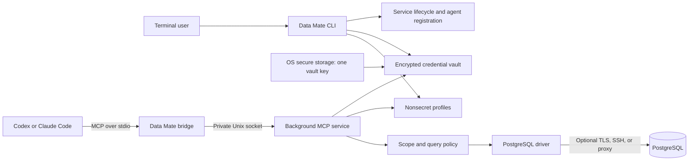

# Data Mate — Technical Design

Status: Proposed implementation design

Baseline: [Product Requirements](PRD.md)

Initial target: Go, macOS on Apple Silicon, PostgreSQL 16 and later

## 1. Purpose and scope

Data Mate makes saved database connections available to independently launched terminal agents through a local, read-only MCP service. Users manage connections and visibility in the terminal; agents discover database structure and query permitted data without receiving connection credentials.

The first version supports Codex and Claude Code, PostgreSQL, and checkout-local development installation. PostgreSQL 16 and 18 are the initial integration test matrix. Other databases and Linux are future extensions. Distribution is deferred; `upgrade` and `update` are informational stubs.

This document specifies intended behavior, interfaces, storage, and validation. It does not imply that these features already exist. The PRD remains the product baseline when older documentation or implementation choices differ.

### Design principles

- One executable, one background service per development installation, and a small number of internal packages.
- Separate ordinary configuration from encrypted credentials; keep only one vault key in OS secure storage per installation.
- Share all database and policy logic across agents. Adapters handle only registration and compatibility.
- Enforce visibility and read-only behavior on every request, including metadata requests.
- Use bounded resources and explicit failure states. Avoid hidden startup, implicit credentials, and silent security downgrades.
- Keep the usual path short: add a connection, optionally narrow its scope, start MCP, then start an agent normally.

### Exclusions

The first version has no GUI, cloud service, accounts, model API integration, agent launcher, database writes, migrations, saved query history, telemetry, plugin loader, or automatic update mechanism. It does not manage database users or change server permissions. It needs no local SQL database for its own state.

## 2. Architecture



The binary runs in three modes:

| Mode             | Responsibility                                                                                       |
| ---------------- | ---------------------------------------------------------------------------------------------------- |
| User CLI         | Interactive and one-shot commands, profile changes, connection diagnostics, registration, lifecycle  |
| Internal service | Own MCP sessions, resolve profiles, decrypt credentials, enforce policy, execute database operations |
| Internal bridge  | Relay MCP messages between an agent's stdio and the service socket                                   |

Internal modes are implementation entry points, not extra setup steps. Agent registration invokes `data-mate mcp bridge --root <absolute-root>`. A private service entry point runs under the lifecycle manager.

The bridge has no database connections, vault key, or profile mutation API. Each bridge creates a separate socket connection and MCP session. This preserves the client-launched stdio model while sharing database work in one background process. Stdout carries protocol messages only; diagnostics use stderr. See the [MCP transport specification](https://modelcontextprotocol.io/specification/2025-11-25/basic/transports).

Use a Unix domain socket in a private directory instead of exposing a local TCP listener. Socket and directory permissions, plus peer-UID checks on both ends, limit access to the current OS user. The bridge relays a bounded stream; the service uses the MCP SDK for initialization, tool dispatch, cancellation, and session shutdown. No second general-purpose RPC framework is necessary.

## 3. CLI contract

All examples use `data-mate`; during development, `make dev ARGS="..."` invokes the installed `.dev` binary.

| Command                              | Behavior                                                                                              |
| ------------------------------------ | ----------------------------------------------------------------------------------------------------- |
| `db add [options]`                   | Collect a connection, preview nonsecret settings, confirm, and save                                   |
| `db scope [alias]`                   | Choose a connection when omitted; select visible schemas/tables and confirm                           |
| `db edit [alias]`                    | Choose a connection when omitted; edit, preview changes, confirm, and save                            |
| `db remove [alias]`, `db rm [alias]` | Choose a connection when omitted; confirm removal of profile and its secrets                          |
| `db list`, `db ls`                   | Show aliases, driver, endpoint, database, and scope summaries                                         |
| `db test [alias]`                    | Test one connection, or all connections when omitted                                                  |
| `mcp start`                          | Ensure supported-agent registrations and start the service idempotently                               |
| `mcp stop`                           | Stop the service and close active sessions; preserve profiles and registration                        |
| `mcp status`                         | Report service identity, state, and supported-agent registration state                                |
| `upgrade`, `update`                  | Explain that distribution is deferred and identify the local rebuild command; make no network request |
| `help`, `version`                    | Show usage or build version                                                                           |

### 3.1 Interaction and automation

The default `db add` form contains only driver, alias, host, port, database, username, and password. Driver defaults to PostgreSQL and port to 5432. Aliases are unique, editable, and limited to lowercase letters, digits, hyphens, and underscores, starting with a letter. Stable internal IDs survive alias changes.

Advanced flags reveal only their corresponding form fields. Suggested groups are `--tls`, `--tls-ca`, `--ssh-host`, `--ssh-user`, `--ssh-key-file`, and `--proxy`. Transport behavior is defined in section 8. Advanced features are off by default, as required by the PRD; the preview always shows the resulting transport protection.

Passwords use hidden terminal input. Previews display only whether a secret is configured or changing. Keeping an existing password and clearing a password are separate choices. Ctrl-C or a negative confirmation leaves persisted state unchanged. Confirmations default to No.

Standard flags for basic fields and `--yes` support scripting. A password may be supplied through `--password-stdin`; secret values are never accepted in command-line arguments or credential-bearing URLs. Stdin password mode consumes one value and cannot simultaneously drive interactive forms. Without a terminal, required missing fields cause a usage error instead of a prompt. No arbitrary command execution is supported in connection fields.

`db scope` supports arrow-key navigation, Space to toggle selections, Enter to preview, and a final Y/N confirmation. A schema row offers “all current and future tables”; individual table selections form a fixed list. Search and lazy expansion keep large catalogs usable. Scripted equivalents are `--all`, repeated `--schema`, repeated `--table schema.table`, and `--none`. For identifiers containing dots or other ambiguous characters, `--scope-json` accepts the structured scope object from section 7. It is mutually exclusive with the other selection flags.

Human output uses restrained color, honors `NO_COLOR`, and disables animation outside a TTY. `--json` on list, test, and status produces stable structured output without color. Errors and progress go to stderr. Exit codes are 0 for success, 1 for operational failure, 2 for invalid usage/configuration, and 130 for user cancellation. Testing multiple profiles continues after individual failures and exits nonzero if any fail.

P2 implements add/edit/remove/list. Forms collect the basic fields in the order
above, keep username visible, and hide all secret input. Omitted edit aliases
select by number or exact alias; remove uses the same selection. Listing and
preview use descriptor-checked read-only access without initializing state or
accessing Keychain. After confirmation, the CLI restores terminal modes, opens
the store, and compares the preview revision before publication. Changes after a
preview fail and require a fresh review. Invalid configuration remains untouched.

`--credentials-stdin` is mutually exclusive with `--password-stdin` and accepts
one strict bounded JSON object containing optional `password`, `ssh_password`,
`ssh_key_passphrase`, and `proxy_password`. Each secret is limited to 128 KiB of
UTF-8. Password stdin accepts one line, removing only one terminal LF/CRLF and
preserving other whitespace. Both modes require complete flags and `--yes`.
Add requires explicit password input or `--passwordless`. Omitted edit secrets
remain unchanged; `--clear-password`, `--clear-ssh-password`,
`--clear-ssh-key-passphrase`, and `--clear-proxy-password` remove individual
secrets. `--clear-ssh` and `--clear-proxy` remove their settings and secrets.
A missing bundle can be repaired with explicit credentials for all configured
transports. Missing keys or corrupt vault accounting are not silently recreated.

Add/edit also accept the scope flags without a catalog fetch. Advanced transport
and limit flags are persisted in P2. P3 implements internal direct/TLS
connectivity and catalogs; CLI diagnostics/browsing and host-key enrollment
remain later packages. `--query-timeout` accepts whole
milliseconds (`1ms`–`30s`); the other limit flags are `--max-rows` and
`--max-result-bytes`. `--tls=false` disables TLS and clears its CA path, while an
omitted CA field is preserved when enabling TLS. SSH key source bytes are imported
once and kept only in the encrypted bundle. No transport is tested while saving.
A durable profile removal with failed credential cleanup exits 1 and reports the
partial outcome; subsequent confirmed mutations retry orphan reconciliation.

### 3.2 Normal workflow

```bash
make install
make dev ARGS="db add"
make dev ARGS="db scope analytics"   # Optional; default scope is all.
make dev ARGS="db test analytics"
make dev ARGS="mcp start"

# Start Codex or Claude Code independently in any project.

make dev ARGS="mcp status"
make dev ARGS="mcp stop"
```

Saving profiles does not start the service or register agents. Once running, the service loads valid profile changes automatically. There is no activation command, separate login, or agent-session grant workflow.

## 4. Agent integration and lifecycle

### 4.1 Registration

Agents discover configured MCP servers; they do not discover arbitrary background processes. `mcp start` bridges this gap automatically by ensuring a user-level stdio registration for each installed supported agent.

Each adapter detects its agent, inspects the existing registration, installs an absent entry, and verifies the result. Prefer the agent's supported configuration CLI, executed with an argument array and no shell interpolation. The effective commands are:

```text
codex mcp add <registration-name> -- <absolute-binary> mcp bridge --root <absolute-root>
claude mcp add --transport stdio --scope user <registration-name> -- <absolute-binary> mcp bridge --root <absolute-root>
```

Codex supports stdio command/argument configuration; Claude Code supports user-scoped registrations across projects. These details must remain covered by adapter compatibility tests. See [Codex MCP configuration](https://learn.chatgpt.com/docs/extend/mcp?surface=cli) and [Claude Code MCP configuration](https://code.claude.com/docs/en/mcp).

Development registrations use `data-mate-dev-<root-hash>`, with an absolute binary and root path. Multiple checkouts therefore have independent service identities and registrations. Start output identifies the registration and checkout so users can distinguish them.

Only change entries owned by this installation. An unrelated entry with the same name is a conflict, not permission to overwrite it. Repeated starts make no duplicate entries. Record the registration identity and expected command locally so uninstall can remove only matching entries. Never reset an agent's whole configuration or weaken its approval, trust, or sandbox settings.

Missing agents are reported as unavailable and skipped. If a detected agent cannot be configured, report partial readiness and exit nonzero; keep any successfully started service and registrations, making the next start a safe retry. An installation with neither supported agent can still run for diagnostics. Native agent approval rules remain in force. New agent sessions load the registration; an already running session may need its normal MCP reconnect or restart action.

### 4.2 Start, stop, and status

Use a per-user `launchd` job for reliable process detachment and supervision. Store its generated plist beneath the installation root; do not install a login item. `mcp start` bootstraps and starts the job explicitly. Automatic login startup and automatic restart after a crash are disabled in v1.

Start performs the following steps under a lifecycle lock:

1. Validate root ownership, profiles, vault format, and executable path.
2. Reuse a healthy matching service or remove only verified stale runtime artifacts.
3. Start the service and wait up to 30 seconds for its versioned readiness handshake. If credentials exist, service startup may invoke native Keychain authorization. Timeout or denial is a clear startup failure.
4. Ensure agent registrations, then print service and per-agent results.

An empty installation can start and advertise zero connections without creating a vault or Keychain item. Database connections open lazily; one unreachable database does not prevent service startup. Invalid configuration or an unreadable existing vault prevents readiness.

Stop tells the owned launchd job to terminate. The service rejects new requests, cancels active work, closes pools and tunnels, and removes its owned socket. Allow five seconds for shutdown before terminating the verified job. Never kill a process solely because its PID appears in a file. Stop is idempotent and does not delete profiles, secrets, or registrations. Bridges never restart a stopped service.

Status checks launchd, the readiness handshake, config validity, and registration metadata. It does not connect to databases, retrieve secrets, unlock Keychain, start processes, or repair configuration. States include stopped, starting, running, degraded, and stale. A running process with invalid reloaded configuration is degraded and cannot execute database tools.

The runtime handshake contains installation identity, process identity, application version, and internal protocol version. It is an internal socket preamble consumed by the bridge before relaying MCP, so agents see only valid MCP messages. A bridge or CLI with an incompatible internal version reports a restart requirement rather than exchanging uncertain messages. A short socket filename under a verified private temporary directory avoids macOS socket path-length limits; its identity maps back to the full installation root.

## 5. Persistent data and configuration

### 5.1 Development layout

```text
.dev/
  bin/data-mate
  config/connections.json
  state/vault.json
  state/vault-usage.json
  state/installation.json
  state/registrations.json
  state/service.plist
  state/state.lock
  state/state-gate.lock
  state/lifecycle.lock
  logs/service.log
```

Runtime sockets live in a private, owner-checked OS temporary directory, with their location recorded in service state. Installation records contain nonsecret identity and owned-artifact inventory only. Directories are mode 0700; profile, vault, state, and log files are mode 0600. P1's identity records the installation UUID, full root digest, established-profile state, purge tombstone, and exact owned paths, including fixed `.tmp` publication siblings. Only the corresponding exclusive writer may recover an interrupted sibling; unknown files remain untouched. Reject symlink substitution for files the application owns and validate ownership before mutation or cleanup.

The development binary resolves its root from its installed location, independent of the working directory; `make dev` also passes the absolute root explicitly. Agent registrations pin that root. Developer roots never fall back to a shared user configuration or another checkout's Keychain namespace. A future distributed installation may use `~/.config/data-mate` for profiles through the same path resolver; no distributed layout is installed now.

### 5.2 Profile schema

```json
{
  "version": 1,
  "connections": [
    {
      "id": "936e3468-5b48-4ef2-9a89-964449f06d98",
      "alias": "analytics",
      "driver": "postgres",
      "connection": {
        "host": "127.0.0.1",
        "port": 5432,
        "database": "analytics",
        "username": "analytics_reader"
      },
      "credential_ref": "4a43b349-904a-49b7-8395-7af73d613165",
      "transport": {
        "tls": { "mode": "disabled" }
      },
      "scope": { "mode": "all" }
    }
  ]
}
```

`credential_ref` addresses an encrypted credential bundle, never an OS credential item. It may be omitted for an explicitly passwordless connection. Version 1 rejects every unknown field, unknown versions, duplicate IDs/aliases/credential references, invalid ports, and embedded secret fields. The decoder rejects duplicate JSON keys recursively, trailing JSON values, invalid UTF-8, inputs over 1 MiB, and more than 128 profiles. Aliases match `^[a-z][a-z0-9_-]{0,62}$`. UUID identity comparisons are case-insensitive; scope names retain case. Driver-specific connection fields are decoded by the selected driver; no unrestricted DSN or option-string passthrough exists.

Profiles may be edited manually using the documented schema. A valid manual profile is equivalent to a CLI-created profile; it requires no hidden activation record. Referencing a nonexistent credential bundle produces `CREDENTIAL_MISSING`. The CLI can attach credentials through `db edit`. File configuration alone cannot create a secret.

P0 freezes the executable profile contract in
`internal/contracts/schemas/profiles.json`. TLS is
`{mode:"disabled"|"verify-full",ca_file?:absolute-path}`; SSH is
`{host,port,user,auth:"password"|"key"}`; SOCKS5 is
`{kind:"socks5",host,port,username?}`. CA files require verified TLS; SSH and
SOCKS5 are mutually exclusive. Authentication material is never stored in these
objects. A missing scope is invalid; profile creation explicitly defaults to all.

Optional `limits` members are `query_timeout_ms` (1..30000, default 10000),
`max_rows` (1..5000, default 500), and `max_result_bytes` (1024..1048576, default
1048576). Omitted members take their individual defaults; zero is not omission.
A revision is SHA-256 over validated canonical JSON, with normalized UUIDs,
explicit defaults, and sorted profiles/scope selections. Formatting and selection
ordering do not change revisions; settings and limits do.

### 5.3 Writes, reloads, and interruption

Use an OS file lock shared by CLI writers and the service, atomic same-directory replacement, file sync, and parent-directory sync. Do not lock a replaceable data file's inode. All changes validate before publication.

Database requests hold a shared state lock from configuration validation through execution and response preparation. CLI changes take the exclusive lock; bounded queries limit the wait. Once a change command succeeds, no operation using the previous configuration remains active. A separate lifecycle lock serializes start, stop, install, and uninstall when those paths are integrated in P8/P11. P1 initialization and its internal purge coordinator already use lifecycle locking. Lock order is lifecycle, admission gate, then state. Readers briefly hold the exclusive admission gate while acquiring a shared state lease; writers retain it through exclusive state access. A process-local writer-preferring queue supplements independently opened OS flock descriptors. Acquisition is context-bounded, and each acquired lease rechecks lock inode and installation identity; a stale waiter cannot mutate a recreated installation.

Configuration and vault are separate files, so writes must remain safe across partial completion:

1. Add or change credentials using a fresh credential reference; durably publish the encrypted vault first.
2. Atomically publish the profile referencing that bundle.
3. Remove unreferenced bundles under the same lock after the profile update.

Removal publishes the profile deletion before removing its credential bundle. A crash may leave encrypted, unreachable bundles, but never a newly published profile referencing an uncommitted bundle. A later successful mutation reconciles orphans under the lock. A failed cleanup is reported distinctly from profile removal; plaintext recovery journals are unnecessary.

Before each database tool call, re-read the small configuration snapshot and detect changes. A changed profile closes its old pool/tunnel and clears cached metadata and credentials. An invalid file blocks database operations until fixed; retaining a broader last-known-good scope would be unsafe. Manual editors should also use atomic replacement. Manual writes do not participate in application locking, so a running request can finish under the snapshot it already accepted; subsequent requests validate the new file.

## 6. Centralized credential vault

### 6.1 Storage model

Store all Data Mate-managed passwords, SSH private-key material/passphrases, and proxy credentials in one encrypted vault file. Store a single randomly generated 256-bit vault key in macOS Keychain. The number of Keychain items stays constant as connections are added or removed.

The key is a generic-password item addressed by a fixed application service name plus an account derived from the canonical installation root. Different developer checkouts use different accounts. Use native Keychain APIs through a small platform adapter; never pass key material through the `security` command's arguments, subprocess output, environment variables, or files. P1 uses the file-based default macOS Keychain for checkout-local ad-hoc executables, with exact service/account queries. Native item-reference deletion preserves exact ownership after binary changes. File-based interaction control is serialized and restored around each native call; OS prompts are synchronous and must finish before an interactive native call can return. A changed executable may need fresh OS approval; denial is an error, never permission to replace the item. OS authorization prompts are permitted; no custom password or biometric UI is introduced. See [Apple Keychain Services](https://developer.apple.com/documentation/security/keychain-services).

The vault is a versioned envelope:

```json
{
  "version": 1,
  "vault_id": "d5c44511-2435-45cb-b3ee-cbf999ae24e1",
  "cipher": "AES-256-GCM",
  "write_sequence": 1,
  "nonce": "<base64>",
  "ciphertext": "<base64 ciphertext including authentication tag>"
}
```

The encrypted plaintext is a versioned map from credential reference to connection ID and its secret fields. Encrypt the whole small document on each mutation. This keeps the format and deletion logic simple without adding SQLite, per-secret Keychain records, or an encryption hierarchy.

Use Go's standard `crypto/aes`, `crypto/cipher`, and `crypto/rand`. Generate a fresh random 96-bit nonce for every write and use the full authentication tag. Authenticate the format version, cipher identifier, vault ID, full root digest, installation UUID, and write sequence using length-prefixed associated data. Bound the envelope size before allocation and validate the decrypted schema before use. Set a conservative maximum of one million writes per key; exceeding it requires a future explicit key-rotation operation rather than nonce reuse. See [Go authenticated encryption APIs](https://pkg.go.dev/crypto/cipher).

P1 bounds the encrypted envelope to 8 MiB, decrypted document to 4 MiB, and each
secret/imported key to 128 KiB. Strict decoding rejects duplicate keys, unknown
fields/versions, null or missing required members, and invalid bundle identities.
Every bundle binds one credential reference to one connection UUID; lookup checks
that binding against a freshly validated profile under its active state lease.

`state/vault-usage.json` holds version, installation UUID, root digest, key
fingerprint and the reserved encryption count. Initialize it durably before
create-if-absent in Keychain. Reserve and sync the next count before generating
the nonce and calling Seal; failed publication consumes that count. Authenticate
the sequence and reject an envelope ahead of its ledger. Removing the last
connection never resets accounting. A key without accounting, mismatched key,
or vault without a key is a repair failure. An unused ledger with neither key nor
vault can safely be reinitialized. This is crash protection, not protection from
same-user rollback of both files; old backup restoration is unsupported.

### 6.2 Key and secret lifecycle

On the first credential save, acquire the exclusive state lock, create the OS key only if no vault exists, and write the initial encrypted vault. A failed file write may leave an unused OS key; a retry reuses it. If a vault already exists, a missing key must never cause automatic key replacement or vault reset.

The service retrieves the key at startup when a vault exists and holds it only for its process lifetime. CLI credential operations retrieve it as needed. Decrypt bundles only at the point of use, retain credentials only as required by active connections, and release references when profiles change or the service stops. Avoid unnecessary string copies and clear mutable buffers where practical; Go memory management does not provide a guarantee of complete secret erasure.

Keychain being locked, unavailable, or denied produces a credential-store error. There is no plaintext fallback. Authentication failure, corruption, or unknown vault format preserves the original bytes and requires repair or explicit credential replacement; it never silently deletes secrets. Listing nonsecret profiles and passive status remain available.

Changing a connection password replaces its encrypted bundle through the publication sequence above. Renaming an alias does not change the connection ID. Removing a connection removes its vault bundle; the one installation key may remain for later use. Purge removes both the owned vault and its exact OS key.

Copying the encrypted vault to another machine or checkout does not provision its OS key. V1 supports copying nonsecret profiles and re-entering credentials; portable credential export and key rotation are deferred. Backup restoration needs the matching original key and namespace. Deletion cannot erase copies held by external backups or guarantee physical erasure on storage devices.

### 6.3 Exposure boundary

Credentials and the vault key never appear in agent configuration, MCP tool results, logs, previews, error messages, command-line arguments, or Data Mate-created plaintext files. Importing an SSH key copies its secret material into the vault without modifying the source file. Avoid logging upstream errors verbatim because authentication and connection errors can contain secrets.

The vault protects secrets at rest and the MCP boundary avoids intentionally delivering them to agents. It is not a sandbox against arbitrary code running as the same OS user, a compromised Data Mate process, or a hostile database server. Strong isolation from a local agent's shell would require an additional OS trust boundary outside v1. Database rows returned by approved queries are intentionally visible to the agent and may be transmitted according to that agent's own configuration.

## 7. Visibility policy

Each connection addresses exactly one database. Its effective visible objects are the intersection of the configured scope, the connected database role's permissions, and the PostgreSQL driver's supported object types. “All” does not grant privileges the role lacks.

| Scope                                                                                        | Meaning                                                                                    |
| -------------------------------------------------------------------------------------------- | ------------------------------------------------------------------------------------------ |
| `{"mode":"all"}`                                                                             | All accessible application schemas/tables, including future ones; default for new profiles |
| `{"mode":"selected","schemas":["reporting"],"tables":[{"schema":"public","name":"orders"}]}` | Every table in `reporting`, plus the named table in `public`                               |
| `{"mode":"selected","schemas":[],"tables":[]}`                                               | No visible objects; never interpreted as all                                               |

Selected schemas and explicit tables form a union. Exact identifiers retain PostgreSQL case and quoting semantics. There are no regexes, deny lists, or wildcard precedence rules. Tables added later enter scope only through `all` or a selected whole schema. A renamed or missing explicit table remains unavailable until the user edits the selection. Recreating the same name selects the new object; the UI describes scope as name-based.

The CLI scope picker may inspect the role's full accessible application catalog because the user is configuring the policy. Agent metadata tools always apply the saved scope. Filter foreign-key targets and other metadata references to hidden objects. Do not expose full system catalogs, server file paths, role listings, credential references, or unrestricted schema definitions through MCP.

The PostgreSQL driver initially executes queries against ordinary and partitioned application tables with supported built-in column types. Catalog discovery can identify other relation kinds as unsupported. Views, materialized views, foreign tables, custom types/operators/functions, and relation features with unverified execution behavior are outside the initial query subset. This limitation is explicit rather than treating “all” as permission to bypass validation.

## 8. Database transport and connection management

Build connection parameters explicitly from the profile and vault. Do not inherit `PGPASSWORD`, `PGSERVICE`, password files, or connection defaults that could silently select credentials or another server.

| Option | Initial behavior                                                                                       |
| ------ | ------------------------------------------------------------------------------------------------------ |
| Direct | TCP to the configured host and port                                                                    |
| TLS    | Off by default; `--tls` enables certificate and hostname verification using system roots or `--tls-ca` |
| SSH    | One explicit jump host; password or imported key authentication; verify against known hosts            |
| Proxy  | Explicit SOCKS5 endpoint, optionally authenticated with credentials from the vault                     |

TLS failure never falls back to plaintext. Do not offer a “skip verification” switch. With TLS disabled, the preview states that database traffic lacks TLS protection; non-loopback endpoints receive a concise confirmation note. This preserves the PRD's opt-in advanced settings while making their effect visible. PostgreSQL password authentication alone does not encrypt query traffic.

SSH host-key enrollment happens only during an interactive connection operation with an explicit fingerprint confirmation; changed host keys fail. The background service cannot accept host keys. Importing a key must not invoke shell commands, SSH config `ProxyCommand`, or arbitrary helper programs. SOCKS5 proxy URLs cannot embed credentials. SSH and proxy are mutually exclusive in v1 to keep the dialing path simple. TLS may be layered over either and verifies the database's configured hostname.

Use `pgx` with driver-owned pools for PostgreSQL access. Pools open lazily, start with zero idle connections, and hold at most two connections per profile. A global semaphore caps active database work at eight operations, with a bounded waiting queue of 32 and a five-second queue deadline. Evict idle pools after five minutes and cap open pools at 16. No idle polling of every database is required. See the [pgx driver documentation](https://pkg.go.dev/github.com/jackc/pgx/v5).

Implemented P3 boundary: `database.Driver` provides Validate/Test/ListTables/
DescribeTable/Query/Invalidate/Close with private in-memory credential access.
Query explicitly fails until P4/P5. One shared PostgreSQL driver owns admission
and pools; callers must retain the profile state lease through driver cleanup.
Each request begins a read-only READ COMMITTED transaction and rechecks role
readiness. Rollback has a separate two-second budget; uncertain connections are
discarded and cleanup failure cannot produce success. Profile changes retire
pools; explicit invalidation cancels active work and invalidates cursors. There is
no cached catalog/grant result. P8 still owns service-level lease integration.

Startup removes inherited `PG*` variables before application goroutines. The
internal initialized pgx template uses explicit placeholders, disabled TLS and
`/dev/null` password/service files, then receives validated settings and an
allowlisted session configuration. A missed startup sanitation fails closed.
Only TCP hostnames/IPs are accepted. Every connection, including readiness and
catalog connections, caps PostgreSQL message bodies at 2 MiB. A constant-memory
frame-length observer preserves RESOURCE_LIMIT when pgx's simple-query error
path otherwise reports only a closed connection; it does not retain message data.

Catalog operations apply privileges/scope in trusted parameterized SQL before
keyset pagination with C collation. Cursor authentication binds version, profile
ID/revision, schema filter, position and process invalidation epoch; tokens are
at most 2 KiB. Pages are capped at 500, columns at 1600, and hierarchy/constraint
materialization at 4096 entries, additionally bounded by operation time and
conservative encoded-payload accounting. Default expressions, full definitions,
and hidden foreign-key endpoints are omitted. Metadata may label unsupported
relation kinds/types, but cannot authorize application execution. P4/P5 must
recheck relation identity, grants and hierarchy after locking.

`db test` exercises profile validation, vault access, network/TLS/SSH/proxy setup, authentication, server version, and policy readiness using the same driver. It does not query application rows or change the database. Report each stage separately, continue through all selected profiles, and redact sensitive upstream messages.

## 9. Read-only PostgreSQL execution

Read-only behavior uses several independent controls. A `SELECT` prefix or a keyword blacklist is insufficient. PostgreSQL read-only transactions also do not prevent every possible external effect. See [transaction access modes](https://www.postgresql.org/docs/16/sql-set-transaction.html).

### 9.1 Role and object boundary

Use a dedicated role with CONNECT, schema USAGE, and SELECT on intended objects. The driver checks effective privileges and blocks execution through superuser, BYPASSRLS, database/object-owner, role-administration, write, schema-creation, or server file/program capabilities relevant to the exposed objects. Reject unsafe inherited capabilities as well as direct ones. The application never grants or revokes server privileges.

P3 evaluates both immediately inherited and SET-reachable role capabilities,
including mixed SET/INHERIT paths and membership ADMIN options. It rejects
application schema/database ownership/creation, relation/column writes, sequence
USAGE/UPDATE, privileged file/program roles or function grants, and PostgreSQL
17+ MAINTAIN. PUBLIC grants are included by PostgreSQL privilege functions.
Read-only readiness checks cover application objects throughout the database,
not only saved scope; TEMP alone is permitted. Role/schema listings and upstream
server diagnostics never become public metadata. Administrator grant changes and
application server code remain trusted configuration, not frozen by this check.

RLS policies execute under the configured role. Owners and BYPASSRLS roles can bypass RLS, so they are unsuitable. Application-defined RLS functions and database administrator behavior remain part of the trusted server configuration; v1 cannot prove arbitrary server code harmless. See [PostgreSQL row security](https://www.postgresql.org/docs/16/ddl-rowsecurity.html).

Role privileges alone do not enforce a narrower configured table scope; the query validator must check every base relation. Ordinary inheritance queries may include descendant tables, so all descendants read by a query must be in scope. Partitioned-table selection includes its partitions; describe that inclusion in the scope picker and validate the partition tree at execution time.

### 9.2 Accepted SQL subset

Parse SQL with a PostgreSQL grammar and traverse typed AST nodes with an explicit allowlist. Use `pg_query_go` behind the PostgreSQL driver; its native parser introduces a build-time C toolchain requirement but avoids implementing SQL parsing by hand. Parser compatibility is pinned and tested against the accepted subset on PostgreSQL 16 and 18. A parser upgrade requires policy regression tests. See the [parser project documentation](https://github.com/pganalyze/pg_query_go).

Initially accept one SELECT statement with projections, filters, joins, grouping, ordering, bounded pagination, subqueries, nonrecursive read-only CTEs, and common aggregates. Every node and expression must be covered by the validator. Unknown nodes fail closed. Restrict casts, operators, aggregate overloads, and functions to audited built-in signatures over supported built-in types; an IMMUTABLE or STABLE label alone is not a security decision.

Require schema-qualified physical relation names. CTE names and aliases resolve through lexical scopes rather than being mistaken for tables. Resolve and validate all base relations, including nested CTEs, subqueries, joins, partitions, and inheritance. Never infer scope from `search_path` or a string search.

Reject multiple statements, data-modifying CTEs, SELECT INTO, locking clauses, DDL/DML, COPY, CALL, DO, transaction/session commands, role changes, prepared-statement execution, user-defined functions, set-returning functions outside the audited subset, and direct system-catalog queries. Do not expose EXPLAIN in v1. Reject unsupported syntax before preparing or planning agent SQL.

Use `search_path = pg_catalog` for deterministic built-in resolution, require explicit relation schemas, and reject temporary relations. Namespaces on their own are not an access-control boundary; PostgreSQL documents the trust implications of function resolution through the search path. See [PostgreSQL schemas](https://www.postgresql.org/docs/16/ddl-schemas.html).

### 9.3 Execution sequence and bounds

For each query:

1. Validate tool input and load the current profile, scope, and credential reference under the shared state lock.
2. Parse and validate the supported SQL structure; acquire a bounded pool connection.
3. Begin a read-only transaction with local statement and lock timeouts.
4. Resolve allowed relation identities, take deterministic relation locks, and recheck identities, privileges, scope, and supported types before executing. Serialize against relevant DDL; do not cache an unchecked authorization decision across requests.
5. Bind parameters separately and execute one validated statement through the extended query protocol.
6. Consume rows incrementally within row and encoded-byte budgets, cancel excess work, and roll back the transaction before releasing the connection and state lock.

Default limits are 10 seconds per query, 1 second waiting on relation locks, 500 returned rows, 1 MiB per result, and 64 KiB SQL input. The maximum configurable query timeout is 30 seconds; the hard result cap is 5,000 rows. A caller may request smaller limits but cannot raise profile or service caps. Use driver protocol message limits as well as response limits so a single oversized value cannot cause an unbounded allocation. Limit parser depth and input size before recursive processing.

Fetch at most one extra row to detect row truncation. When bytes or rows exceed the budget, return a complete bounded result with `truncated: true`, never broken JSON. Query timeout/cancellation returns a structured failure; partial results are not presented as complete. If cleanup or cancellation leaves connection state uncertain, discard the connection. Do not automatically retry an executing query.

This policy is intentionally narrower than all PostgreSQL SELECT syntax. The safety gate is the tested accepted subset; unsupported queries receive a specific explanation and a suggested supported form when possible.

## 10. MCP contract

Expose four tools with stable names and strict JSON input/output schemas:

| Tool               | Input                                                                | Output                                                                 |
| ------------------ | -------------------------------------------------------------------- | ---------------------------------------------------------------------- |
| `list_connections` | None                                                                 | Alias, driver, database label, and configured scope summary            |
| `list_tables`      | Connection alias, optional schema and page cursor                    | Visible table names/kinds and bounded summaries                        |
| `describe_table`   | Connection alias, exact schema and table                             | Columns, supported types, nullability, keys, and visible relationships |
| `query`            | Connection alias, SQL, optional typed parameters and lower row limit | Columns, rows, row count, truncation, and elapsed time                 |

Metadata pages default to 100 objects and cap at 500, with the same byte budget as query results. Cursors carry only pagination position and the configuration revision; reject stale cursors after a scope change. No tool accepts a host, DSN, credential, arbitrary file path, or connection override. No tool creates profiles or broadens scope.

All tools declare read-only intent using MCP annotations, but enforcement remains server-side. A session cannot alter the service's policy. No sampling, prompts, subscriptions, or persistent MCP resources are required initially. Missing initialization or malformed protocol input is handled by the SDK.

Example query result, carried as MCP structured content:

```json
{
  "connection": "analytics",
  "columns": [{ "name": "order_count", "type": "int8" }],
  "rows": [["42"]],
  "row_count": 1,
  "truncated": false,
  "elapsed_ms": 8
}
```

Rows use arrays aligned with column metadata to preserve duplicate column names. Encode int8 and exact decimal values as strings, timestamps in ISO 8601, binary values as base64 with type metadata, SQL NULL as JSON null, and JSON values as structured JSON. Preserve timezone meaning and avoid lossy conversion through floating-point numbers. The codec specification must cover each accepted PostgreSQL type.

Tool failures use `isError` and a stable code such as `CONFIG_INVALID`, `CONNECTION_NOT_FOUND`, `CREDENTIAL_MISSING`, `VAULT_UNAVAILABLE`, `CONNECT_FAILED`, `SCOPE_DENIED`, `QUERY_UNSUPPORTED`, `QUERY_TIMEOUT`, or `RESOURCE_LIMIT`. Include a concise safe message and retry guidance. Protocol errors remain JSON-RPC errors. Never return raw DSNs, SQL parameter values, PostgreSQL error detail/hints, or decrypted data in diagnostics.

P0 freezes strict input/output schemas and examples under
`internal/contracts/schemas` and `internal/contracts/testdata`; tool objects reject
additional fields. Inputs are exactly the four tools above. Query parameters use
ordered `{type,value}` objects (at most 256), canonical PostgreSQL scalar names,
and the codec representations, including null. Parameters, SQL semantic checks,
and per-profile caps require downstream runtime validation; schemas alone do not
authorize execution. Central errors also include `POLICY_UNSAFE`, `STALE_CURSOR`,
`INVALID_ARGUMENT`, `SERVICE_UNAVAILABLE`, and `CANCELLED`.

CLI list/test/status schemas use a `version:1` envelope with `connections`,
`results`, or `state`/`agents`, respectively. These schemas define future output;
P0's unfinished commands return nonzero and emit no success object. Versioned
PostgreSQL codec/signature fixture formats live under
`internal/database/postgres/testdata`; native codec execution and catalog-verified
compiler signatures remain P4/P5 gates.

Treat database comments and text values as untrusted data. Return them as data, never as operational instructions. Scope can prevent retrieval of unauthorized objects; it cannot make permitted text immune to prompt injection in the consuming agent.

## 11. Code organization and dependencies

```text
cmd/data-mate/main.go
internal/
  cli/                 Commands, forms, output, exit codes
  config/              Profiles, validation, atomic persistence, paths
  vault/               Encrypted file and OS key provider
  service/             Lifecycle, state reload, sessions, resource bounds
  mcp/                 Tool schemas, handlers, stdio bridge
  agent/               Registration interface, Codex and Claude adapters
  database/            Driver contracts and shared result types
    postgres/          pgx, introspection, SQL policy, PostgreSQL codecs
  transport/           Direct, TLS, SSH, and SOCKS5 dialing
scripts/               Build, install, uninstall, format, integration helpers
specs/PRD.md
specs/DESIGN.md
Makefile
VERSION
AGENTS.md
CLAUDE.md
```

Keep concrete implementations unless a real external boundary needs substitution. The main boundaries are:

| Boundary        | Operations                                                                                     |
| --------------- | ---------------------------------------------------------------------------------------------- |
| Agent adapter   | Detect, inspect registration, ensure registration, remove owned registration                   |
| Database driver | Validate settings, test, list tables, describe table, execute bounded read-only request, close |
| OS key provider | Load, create-if-absent, delete exact installation key                                          |
| Dialer          | Dial with context and close owned transport resources                                          |

Scope evaluation and query validation remain driver-aware. A future MongoDB driver can expose its native query capability rather than pretending to parse SQL. New drivers must satisfy the same credential, scope, cancellation, and read-only contract before registration; do not add a plugin system or a universal query language in advance.

Prefer the Go standard library for JSON, filesystem operations, encryption, logging, and lifecycle orchestration. Use the official [Go MCP SDK](https://github.com/modelcontextprotocol/go-sdk), pgx, the PostgreSQL parser, and the Go SSH/proxy packages. Use one small CLI/form stack for flags and interactive selection; avoid a permanent full-screen application. Pin versions in `go.mod` and `go.sum`, and verify supported platform and build dependencies when implementation begins.

Create root `AGENTS.md` for project guidelines and `CLAUDE.md` pointing to it during scaffolding, as required by the PRD. Those files should describe project conventions rather than duplicate this design.

## 12. Development operations and cleanup

`VERSION` is the only checked-in application version source. Build metadata may add revision and dirty-state information without changing that file.

| Target                     | Contract                                                                                                                                          |
| -------------------------- | ------------------------------------------------------------------------------------------------------------------------------------------------- |
| `make setup`               | Check build prerequisites and prepare pinned Go dependencies/tools; do not build the application or create `.dev`                                 |
| `make install`             | Prepare Go dependencies, build, and install into `.dev/bin`; no service startup                                                                   |
| `make build`               | Build and refresh `.dev/bin/data-mate`; no agent or credential changes                                                                            |
| `make dev ARGS="..."`      | Run the installed development binary with the checkout's absolute root                                                                            |
| `make clean`               | Alias for default uninstall; always disable purge, preserving profiles and credentials even if `PURGE=1` is supplied                              |
| `make uninstall`           | Stop this installation, remove matching agent registrations, installed binary, and owned build/runtime artifacts; preserve profiles and vault/key |
| `make uninstall PURGE=1`   | Additionally remove this installation's profiles, encrypted vault, exact OS key, and owned state/logs                                             |
| `make format`, `make tidy` | Format Go and Bash; `tidy` is an alias                                                                                                            |
| `make lint`                | Run configured Go static checks                                                                                                                   |
| `make test`                | Run unit/regression tests with fakes and synthetic fixtures                                                                                       |
| `make test-integration`    | Explicit Docker integration tests; PostgreSQL 16 and 18 by default                                                                                |

Check required Go, C compiler/macOS SDK, and formatter tooling; provide installation guidance for missing system tools. Install module dependencies through Go modules. Docker is required only for explicit integration runs. Do not change system tooling silently.

Installation runs dependency setup before the application build. `VERBOSE=1` enables Go download/build command diagnostics for `make setup`, `make install`, and `make build`.

Rebuilding an active service does not hot-swap its executable image. Report that `mcp stop` followed by `mcp start` is needed to run the new version. A stopped bridge reports the ordinary service-not-running diagnostic.

All cleanup uses the installation inventory and verified ownership. Preserve unrelated `.dev` contents and remove the root directory only if empty. P1 implements only the inner credential purge coordinator: mark a durable purge tombstone, delete the exact native item, then remove owned profiles/vault/usage files and their publication siblings. Identity and stable locks remain for retry; ordinary state access is rejected once purge starts. P11 integrates service/registration/binary cleanup and removes identity/locks last. A purge failure reports remaining owned artifacts and can be retried; it must not claim success if the vault or OS key remains. Keep enough ownership metadata to retry a partially completed purge. Preserve external agent settings, imported key source files, and user-managed certificates.

Use `.misc` for retained implementation plans, test evidence, and status reports. `.tmp` remains developer-managed. CI and local tests use isolated roots and fake key providers unless a native test explicitly opts in.

## 13. Validation and acceptance

### 13.1 Automated tests

| Area                  | Required coverage                                                                                                                                                                                     |
| --------------------- | ----------------------------------------------------------------------------------------------------------------------------------------------------------------------------------------------------- |
| Configuration         | Duplicate keys/IDs, invalid versions, manual profiles, empty scope, alias changes, atomic writes, concurrent mutations                                                                                |
| Vault                 | One key across many connections, nonce changes, tamper/wrong-key detection, unavailable OS store, crash publication order, removal and retryable purge                                                |
| CLI                   | Hidden secret entry, preview/cancel, non-TTY behavior, JSON output, aliases, multi-profile test failures                                                                                              |
| Agents and lifecycle  | Registration preservation/conflicts, two checkouts, idempotent start/stop, startup failure, stale identity, version mismatch, bridge disconnect                                                       |
| MCP                   | Initialization, tool schemas, independent sessions, bounded frames, cancellation, no secret exposure                                                                                                  |
| PostgreSQL policy     | Allowed query corpus and rejection corpus: nested writes, multi-statements, quoted names, alias/CTE shadowing, hidden relations, functions, operators, casts, partitions, inheritance, catalog access |
| Resources and cleanup | Oversized cells/messages, row truncation, queue saturation, timeout rollback, connection disposal, no unrelated file removal                                                                          |

Fuzz JSON/vault decoding and SQL-policy traversal using size-bounded inputs. Run concurrency-sensitive packages with Go's race detector. CI runs formatting checks, lint, build, and the non-integration suite on macOS Apple Silicon, with no real credentials or user agent configuration.

### 13.2 Explicit integration tests

`make test-integration` creates and tears down its own Docker containers, networks, credentials, and synthetic data. It never accepts an arbitrary existing database URL and is not part of CI. Use `DB_DRIVER=postgres DB_IMAGE=postgres:16` or `postgres:18` to select a matrix entry; image overrides must still pass the driver's version and readiness checks. Future drivers supply their own container setup.

The suite verifies scoped introspection and queries, TLS failures, insufficient/unsafe roles, RLS, SQL bypass attempts, timeout/cancel behavior, schema changes during queries, oversized results, and unchanged database data after rejected operations. Test SSH and SOCKS5 with owned local fixtures. Teardown runs on success, failure, and interruption.

Native macOS checks separately verify one Keychain item for many saved connections, OS authorization denial, restart reuse, and exact-key purge. Actual Codex and Claude Code smoke tests verify registration and one complete read-only workflow. Fake-provider tests cannot substitute for these native checks.

### 13.3 First-version acceptance

1. A developer installs locally, adds a PostgreSQL connection, optionally narrows its scope, and runs `mcp start` without a separate agent setup command.
2. Independently started Codex and Claude Code sessions list and query only the configured visible objects.
3. Adding connections does not add per-connection Keychain items; credentials remain absent from profiles, agent settings, logs, and protocol output.
4. A profile edit takes effect on subsequent operations, and a completed scope change cannot leave an old-scope operation active.
5. Rejected SQL cannot modify the database or retrieve hidden objects in the tested adversarial corpus; accepted SQL remains bounded and cancellable.
6. Default uninstall preserves profiles and credentials. Explicit purge removes only owned installation data and its single OS key.
7. PostgreSQL 16 and 18 integration runs and both native agent workflows pass before declaring v1 ready.

## 14. Implementation sequence and decision gates

Complete and validate one work package before beginning the next:

| Package                             | Deliverable                                                                         | Gate                                                                     |
| ----------------------------------- | ----------------------------------------------------------------------------------- | ------------------------------------------------------------------------ |
| 1. Foundation                       | Guidelines, Go module, Make/scripts, root isolation, profile schema and CLI shell   | Local install/build and isolated config regression tests                 |
| 2. Credentials and profiles         | Native key provider, encrypted vault, add/edit/remove/list                          | Native single-key test, interruption recovery, redaction and purge tests |
| 3. PostgreSQL boundary              | Direct/TLS driver, role checks, catalog scope, accepted SQL subset, bounded results | PostgreSQL 16/18 policy and cancellation integration evidence            |
| 4. Optional transports and scope UX | SSH, SOCKS5, interactive scope selector, `db test`                                  | Transport verification and interactive/noninteractive behavior checks    |
| 5. MCP and agents                   | Service, bridge, four tools, automatic registration and lifecycle                   | Real Codex/Claude Code smoke tests and concurrent-session checks         |
| 6. Completion                       | Cleanup, limits, documentation, full local validation                               | Every acceptance criterion above has recorded evidence                   |

Resolve the highest-risk feasibility points before expanding functionality: native Keychain behavior for development builds, reliable PostgreSQL semantic validation for the accepted subset, driver allocation bounds, and adapter compatibility. If a construct cannot be enforced safely, keep it outside the supported subset and report the limitation. Do not replace a failed gate with a broader unverified claim.

Future work can add Linux through the OS key/lifecycle adapters, new database drivers through the driver contract, and distribution through separate installation/update work. These extensions must preserve the centralized vault and existing CLI workflow.
