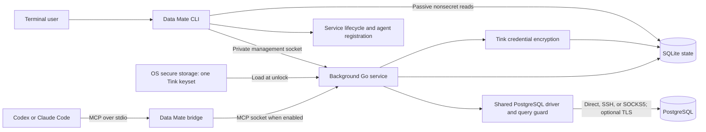

# Data Mate — Technical Design

## 1. Purpose and scope

Data Mate makes saved database connections available to independently launched terminal agents through a local, read-only MCP service. Users manage connections and visibility in the terminal; agents discover database structure and query permitted data without receiving connection credentials.

This document defines the implemented architecture and technical contracts for Tink, SQLite, and centralized service-owned credential access, plus the proposed distribution contracts in section 13. The [PRD](PRD.md) defines product requirements, the [README](../README.md) documents implemented setup and usage, and the [changelog](../CHANGELOG.md) records user-visible changes. Implementation plans and validation evidence belong in ignored `.misc`, not in this design. Data Mate has never been released, so compatibility with the development-only vault format is not required; implementation must report obsolete state without silently deleting it.

The supported platform is macOS on Apple Silicon, with one Go executable installed in the checkout's `.dev`. Agent adapters support Codex and Claude Code. PostgreSQL is the only database driver: PostgreSQL 16 or later is required, without per-major semantic manifests. SQL syntax is bounded by the pinned native parser version. PostgreSQL 16 and 18 form the integration matrix.

Production distribution, explicit upgrades, terminal uninstall, shell completion, and development/production service exclusion are implemented under section 13. Public installation remains unavailable until a stable release is published and its native acceptance gates pass. Other database drivers, Linux, unattended updates, credential export, and key rotation remain deferred. The key-provider boundary accommodates a future Linux Secret Service implementation without changing credential encryption. Windows and Intel macOS are outside the product scope. There is no GUI, Electron runtime, cloud service, account system, model API integration, agent launcher, database mutation tool, PostgreSQL migration runner, query history, telemetry, or plugin loader. SQLite stores Data Mate's own state only; Data Mate does not manage database users or change server permissions.

The design follows these principles:

- One background service per installation owns credential access, profile mutations, and shared database operations; MCP exposure is explicitly enabled.
- SQLite stores nonsecret profiles and encrypted credential bundles in separate records; one Tink keyset lives in OS secure storage.
- Tink owns encryption, nonce generation, authentication, and ciphertext/keyset formats. Data Mate owns input validation, context binding, persistence, and lifecycle policy.
- Query and metadata tools enforce saved direct-relation scope; PostgreSQL owns grants and query semantics.
- Resources, cancellation, ownership, and partial failures have explicit bounds and outcomes.
- The normal workflow is add a connection, optionally narrow scope, start MCP, and launch an agent normally.

## 2. Architecture



The binary has three process roles:

| Role             | Responsibility                                                                                           |
| ---------------- | -------------------------------------------------------------------------------------------------------- |
| User CLI         | Forms, confirmed management requests, passive nonsecret reads, agent registration, and service lifecycle |
| Internal service | Profile mutations, OS keyset access, Tink encryption, CLI database operations, and enabled MCP sessions  |
| Internal bridge  | Relay bounded MCP messages between agent stdio and the service socket                                    |

Development agent registration invokes `data-mate mcp bridge --root <absolute-root>`. Planned production registration omits `--root` and uses the fixed installation described in section 13.2. A private service entry point runs under launchd, initially in management-only mode unless started through `mcp start`. These internal commands require no separate user setup. The bridge has no database connection, keyset, or management API. Each bridge creates one socket connection and an independent MCP session. Stdout carries protocol messages only; diagnostics use stderr.

The service listens on a Unix domain socket in an owner-checked private directory. Directory/socket permissions and native peer UID/PID checks authenticate local peers before MCP begins. A bounded identity preamble precedes the SDK transport; agents see only MCP messages. The service uses the pinned Go MCP SDK for initialized protocol handling, tool dispatch, cancellation, and session shutdown.

### Package boundaries

| Location                                            | Responsibility                                                                                      |
| --------------------------------------------------- | --------------------------------------------------------------------------------------------------- |
| `cmd/data-mate`, `internal/cli`                     | Entry point, commands, forms, output, and exit contracts                                            |
| `internal/config`                                   | Profile validation, revisions, SQLite transactions/schema, paths, ownership, and locks              |
| `internal/contracts`                                | Strict public JSON schemas, decoding, examples, and safe error codes                                |
| `internal/vault`                                    | Tink credential encryption, authenticated context, keyset lifecycle, and OS key providers           |
| `internal/database`                                 | Shared driver operations and result/access types                                                    |
| `internal/database/postgres`                        | Connections, pools, catalogs, read-only transactions, execution, and codecs                         |
| `internal/database/postgres/sqlguard`               | Bounded statement-kind and direct-relation scope checks                                             |
| `internal/transport`                                | Direct, TLS, SSH, and SOCKS5 connection paths and owned SSH host pins                               |
| `internal/service`                                  | Lifecycle, identity, separate management/MCP listeners, profile mutations, and request coordination |
| `internal/mcp`                                      | Tool handlers, session framing/admission, and stdio bridge                                          |
| `internal/agent`                                    | Client detection, registration inspection, and ownership-safe mutation                              |
| `internal/devtools`, `scripts`, `.github/workflows` | Developer commands, regression harnesses, and CI                                                    |

Concrete packages implement most behavior. Interfaces represent external seams: the database driver, key provider, lifecycle/client operations, and dialing. `database.Driver` supplies validation, diagnostics, table listing, description, query execution, invalidation, and close. PostgreSQL also supplies the CLI catalog-browsing operation. Callers hold the profile state lease until driver cleanup and result preparation finish. Credentials travel only through private in-memory access snapshots.

Agent adapters own compatibility and registration, not database policy. Scope and query semantics remain driver-aware. Additional drivers must satisfy the credential, visibility, cancellation, and read-only contracts; there is no universal query language or dynamic plugin framework.

Implementation dependencies are pinned in [go.mod](../go.mod) and `go.sum`. The implementation uses pinned `github.com/tink-crypto/tink-go/v2` and `github.com/mattn/go-sqlite3` alongside the CLI, MCP, PostgreSQL, and transport dependencies. Tink provides credential cryptography; the standard library handles JSON, filesystem/process primitives, and non-credential hashing where suitable. Native Keychain access and the PostgreSQL parser require cgo and the macOS SDK. OS adapter selection and native validation are specified in section 6.3.

## 3. CLI contract

During development, `make dev ARGS="..."` invokes the installed binary with the checkout's absolute `.dev/data-mate` data root.

The table below describes implemented commands. Section 13.1 defines production command availability and completion.

| Command                              | Behavior                                                                            |
| ------------------------------------ | ----------------------------------------------------------------------------------- |
| `db add [options]`                   | Collect a connection, preview nonsecret settings, confirm, and save                 |
| `db edit [alias]`                    | Select a connection when omitted; edit, preview, confirm, and save                  |
| `db scope [alias]`                   | Select a connection when omitted; replace visible schemas/tables after confirmation |
| `db remove [alias]`, `db rm [alias]` | Confirm removal of a profile and its credentials                                    |
| `db list`, `db ls`                   | Show aliases, driver, endpoint, database, and scope                                 |
| `db test [alias]`                    | Diagnose one connection, or all in alias order when omitted                         |
| `mcp start`                          | Start or reuse the service, then ensure supported-agent registrations               |
| `mcp stop`                           | Stop the service and sessions; preserve profiles and registrations                  |
| `mcp status`                         | Passively report service and supported-agent registration states                    |
| `upgrade`, `update`                  | Install the latest verified stable release in production; development uses Make     |
| `help`, `version`                    | Show usage or build version                                                         |

Confirmed profile changes start or reuse the management-only service without exposing MCP or registering agents. `db test` and interactive catalog browsing also use that service. Listing and previews remain passive nonsecret reads. `mcp start` explicitly enables agent access. There is no activation command, login, or per-agent grant workflow.

### 3.1 Forms and credential input

The basic add form asks for driver, alias, host, port, database, username, and password, in that order. PostgreSQL and port 5432 are defaults. Username remains visible; secret input is hidden. Advanced flags enable their corresponding transport fields. Aliases are unique and editable; stable connection IDs survive renames.

Previews show only nonsecret settings and whether a secret is configured or changing. Blank edit fields preserve existing values; keeping and clearing a secret are separate actions. Confirmations default to No. Ctrl-C during the form or negative confirmation exits 130 without publishing a connection change. Cancellation after submission follows the transaction-outcome rules below. Omitted edit/remove aliases use selection by number or exact alias.

Listing and previews use ownership-checked read-only SQLite access without initializing state or accessing Keychain. After confirmation, terminal modes are restored before the CLI starts/reuses the service and submits the mutation. The service compares the preview revision with the current revision, including a change generation covering credential edits; a stale preview requires a fresh review. Invalid configuration remains untouched. Normal saves do not test a connection; explicit SSH enrollment is the only save-time network probe.

Scripts supply complete required fields and `--yes`. Non-TTY commands report missing input rather than prompt. Add requires explicit password input or `--passwordless`. Secret input modes are mutually exclusive and cannot also drive a form:

| Input                 | Contract                                                                                                                    |
| --------------------- | --------------------------------------------------------------------------------------------------------------------------- |
| `--password-stdin`    | One UTF-8 password line; remove only one terminal LF or CRLF, preserving other whitespace                                   |
| `--credentials-stdin` | One strict bounded JSON object with optional `password`, `ssh_password`, `ssh_key_passphrase`, and `proxy_password` strings |

Both modes require `--yes`; each secret is limited to 128 KiB. Secrets are never accepted as command-line values or in credential-bearing URLs. The [credential input schema](../internal/contracts/schemas/credentials-input.json) defines the JSON object.

Omitted edit secrets remain unchanged. `--clear-password`, `--clear-ssh-password`, `--clear-ssh-key-passphrase`, and `--clear-proxy-password` clear individual secrets. `--clear-ssh` and `--clear-proxy` clear both transport settings and their secrets. SSH key files are read once by the CLI and submitted as bounded secret bytes for encryption; their source files remain untouched. A missing bundle can be repaired by explicitly supplying credentials for all configured transports. Missing keysets or corrupt persistent state are never silently recreated.

Advanced options include `--tls`, `--tls-ca`, `--ssh-host`, `--ssh-port`, `--ssh-user`, `--ssh-key-file`, `--ssh-enroll`, `--proxy`, and `--proxy-user`. TLS, SSH, and SOCKS5 are off by default. `--tls=false` clears the CA path; enabling TLS preserves an omitted existing CA field. Transport rules are specified in section 8. Limits use `--query-timeout` in whole milliseconds from `1ms` to `5m`, `--max-rows`, and `--max-result-bytes`.

A profile and its encrypted bundle are removed in the same SQLite transaction. They are either both removed or both preserved. If a reply is lost after commit, report that the outcome is unknown and require a fresh state read before retrying; do not imply rollback or automatically replay the mutation.

### 3.2 Scope selection

Add, edit, and scope commands accept `--all`, `--none`, repeated `--schema`, repeated `--table schema.table`, or `--scope-json`. Schema and table selections can be combined; all/none/JSON are mutually exclusive with those selections. Structured JSON preserves identifiers containing dots or other ambiguous characters. Scripted replacement performs no catalog fetch or credential access for the scope operation.

Interactive `db scope` browses the role's accessible application catalog independently of saved scope. Up/Down navigates, Right expands a schema, Left returns to schemas, Space toggles, `/` searches, `n` advances, and `b` restarts pagination. `a` selects all and `0` clears the selection. Enter previews the result before a final default-No confirmation. Whole-schema selection includes current and future tables. To narrow an all/schema selection, clear that broad selection before choosing individual tables.

Each fetch retains at most 50 schemas or tables and performs literal case-insensitive search at the current level. Selections absent from the current page remain intact. Search is bounded to 256 bytes; interactive selections are bounded to 4096 schemas/tables and half the profile byte budget. Catalog browsing never authorizes a query.

Each service-side fetch opens a fresh shared state lease, verifies the preview revision, and reads credentials and host pins under that lease. Database cleanup finishes before lease release; human input holds no lease. Final scope publication uses an exclusive lease and SQLite transaction with revision comparison, without decrypting credentials. Browsing starts/reuses the management service but never creates or repairs credentials; scripted scope replacement needs no catalog access or keyset unlock.

### 3.3 Diagnostics and output

`db test` runs selected profiles sequentially in alias order with a per-profile deadline that includes lease acquisition and vault access. Each result records reached `config`, `vault`, `dial`, `authentication`, `version`, and `read_only` stages. Dial includes the route and TLS handshake; an observed PostgreSQL authentication exchange distinguishes authentication failures. The final stage verifies the actual read-only transaction and authenticated identity, without reading application rows or auditing grants. Success does not certify that the operator has provisioned a restricted account or authorize later queries.

The terminal `stage` and `ok` fields summarize each result. A failed stage includes a safe error object; later stages are omitted. Ordinary per-profile failures continue the batch. Invalid profile state and unknown aliases fail before output because no validated selection exists. Cancellation stops the command. Output occurs after releasing state leases. Diagnostics run through the management service and may unlock an existing keyset, but do not create or repair secrets, keysets, or database grants.

Human previews honor `NO_COLOR`; machine output has no color. `db list`, `db test`, and all three public MCP lifecycle commands support `--json`. Their version-1 envelopes contain `connections`, `results`, or service `state`/`agents`/`mcp_enabled`/`keyset_state`; exact contracts live in [schemas](../internal/contracts/schemas). Diagnostics use stderr. Exit codes are 0 for success, 1 for operational failure, 2 for invalid usage/configuration, and 130 for cancellation. A test batch exits nonzero if any profile fails.

## 4. Agent integration and service lifecycle

### 4.1 Registration and ownership

`mcp start` ensures a user-level stdio registration for each installed supported client after service readiness. Each adapter detects its client, inspects existing configuration, adds an absent entry, and verifies the result. Client writes use argument arrays with no shell interpolation. The implemented development registrations are:

```text
codex mcp add <registration-name> -- <absolute-binary> mcp bridge --root <absolute-root>
claude mcp add --transport stdio --scope user <registration-name> -- <absolute-binary> mcp bridge --root <absolute-root>
```

The development registration name is `data-mate-dev-<root-hash>`, using the first 16 hexadecimal characters of the canonical root digest. Absolute binary/root paths isolate checkouts. Production registrations use `data-mate` and omit `--root` as specified in section 13.2. Start output identifies the registration and root. New agent sessions load the registration; existing sessions may need their normal reconnect or restart. Native approval, trust, sandbox, managed policy, and project overrides remain the client's responsibility.

Inspection reads Codex TOML and Claude user-scope JSON directly, without invoking client health checks. Codex uses `$CODEX_HOME/config.toml` or `~/.codex/config.toml`; Claude uses `$CLAUDE_CONFIG_DIR/.claude.json` or `~/.claude.json`. Overrides must be absolute. Reads are capped at 4 MiB and reject unsafe files, duplicate keys, and unsupported layouts. Only absolute PATH directories participate in detection and child PATH. Registration subprocesses run from `/` with eight-second and 64-KiB output bounds; their output is discarded.

`registrations.json` binds its version, installation UUID, full root/digest, client/config location, name, expected command/arguments, canonical entry fingerprint, and intent/owned phase. Add intent is durable before the client write. A retry reconciles an interrupted add only when the entry matches exactly. Matching unrecorded entries are usable without granting deletion authority. Removal requires recorded ownership and an unchanged fingerprint. A relocated config override remains a start conflict; cleanup uses the exact recorded configuration location. Unrelated same-name entries remain conflicts.

Configuration is inspected immediately before and after client writes; unrelated values must remain unchanged. External client edits are not transactionally locked by Data Mate. Observed changes produce a conflict, and Data Mate does not overwrite user changes through wholesale rollback.

Agent states are `unavailable`, `pending`, `ready`, `disabled`, `conflict`, and `failed`. Ready means the user registration matches, not that session policy grants access. Codex's disabled flag is preserved and reported. Missing clients are skipped and do not block service startup. Adapter failures exit 1 while retaining the healthy service and successful registrations, making another start a safe retry. Passive status reads ownership and client configuration without repair; invalid/unreadable metadata exits 2.

### 4.2 Start, stop, and status

The lifecycle manager uses one job in the current user's GUI launchd domain. Its generated plist lives beneath the installation root. A confirmed mutation or explicit CLI database operation may bootstrap the job in management-only mode; `mcp start` starts or enables MCP on the same process. There is no login item. `RunAtLoad=true` applies to bootstrap, `KeepAlive=false` disables crash restart, and `ExitTimeOut=5` delegates forced termination to the verified job. The management service persists across CLI invocations until stopped or the login session ends.

Section 13.6 enforces first-wins exclusion across production and development roots, including management-only services; per-installation ownership and readiness checks still apply.

Start serializes these operations under the lifecycle lock:

1. Validate installation ownership, profiles, executable identity, and owned runtime state.
2. Reuse a healthy matching service or clean up only verified stale resources.
3. Start/reuse the management service, validate existing credential bundles using its loaded keyset, and enable the MCP listener. Readiness has a 30-second deadline. An explicit interactive start may authorize keyset access; denial or timeout leaves MCP disabled. A previously healthy management process is preserved on enablement failure.
4. Ensure agent registrations, then report service and independent per-agent results.

An empty installation starts with zero connections without creating a keyset. Management readiness requires valid SQLite state but permits a locked keyset so nonsecret operations remain available. Keyset state is `absent`, `locked`, `ready`, or `unavailable`; it is separate from MCP enablement and process readiness. Existing credentials must be readable before MCP is enabled. Database connections open lazily, so an unreachable database does not prevent readiness. Startup failures clean only newly created, verified partial runtime resources.

`mcp stop` terminates the whole verified job, including management-only instances. The service rejects new work, cancels active operations, and closes sessions, pools, transports, SQLite handles, and the in-memory keyset. The launchd adapter verifies the exact plist path and ProgramArguments from bounded inspection output before bootout; unknown layouts fail closed. It waits for job removal before unlinking owned runtime state. A PID file alone never authorizes signaling a process. Stop is idempotent and preserves profiles, credentials, and registrations. A later explicit CLI management operation may start a new management-only instance; bridges never start or restart the service.

Status checks launchd, runtime identity/readiness, profile validity, and registration metadata. It does not connect to databases, retrieve secrets, unlock Keychain, start processes, or repair configuration. Service states are `stopped`, `starting`, `running`, `degraded`, and `stale`; status also reports `mcp_enabled` and the service's nonsecret keyset state. A management-only process is never presented as available to agents. Invalid reloaded configuration degrades a running service and blocks database work. Stopped is a successful query; invalid configuration/state exits 2 and other inspection failures exit 1. Status still emits the requested report alongside stderr diagnostics on failure. Public status schemas must be updated with implementation.

### 4.3 Runtime identity and handshake

Service state binds the full installation identity, internal protocol version, instance nonce, application version/revision, executable SHA-256, and observed PID. A byte-changing rebuild requires restart even if version/revision are unchanged. Incompatible bridges and CLI probes report the mismatch instead of relaying uncertain protocol messages.

The preamble is a four-byte big-endian length followed by strict JSON, capped at 4 KiB before body allocation. Both peers check native UID/PID and the full identity/nonce. The MCP socket is `/private/tmp/dm-<uid>-<root-suffix>/s`; a distinct `m` socket in that directory serves management requests. An independent marker binds the directory to the full installation identity. The directory is mode 0700; marker and sockets are mode 0600. Short runtime paths support long installation paths and spaces; service roots containing control characters are rejected. Cleanup preserves unrelated runtime entries.

Daemon streams go to `/dev/null`; the service creates no persistent log. Callers receive bounded safe readiness diagnostics.

### 4.4 Private management protocol

Only the CLI management path can submit profile mutations, credential patches, scope browsing, and diagnostic requests. MCP sessions and bridges have no dispatch path to these operations. Management peers verify the installation, protocol version, instance nonce, UID/PID, and expected executable identity before sending secrets. This separates interfaces within the application; it is not a sandbox against arbitrary code running as the same OS user.

Requests carry an operation, expected revision, and bounded typed input. There is no generic SQL, arbitrary-path, keyset-export, or saved-password retrieval endpoint. The CLI submits only newly entered secret values and explicit keep/clear actions; merging with saved secrets happens inside the service. Responses contain nonsecret state or safe operation results. The service revalidates all requests independently of CLI validation.

Management frames use length-prefixed strict JSON with an 8 MiB request cap checked before allocation; decoded profiles, individual secrets, and replies retain their smaller owning-contract bounds. Allow at most four active management requests and reject excess requests without an unbounded queue. Handshakes and blocked output retain the ten-second and five-second bounds. Propagate caller cancellation and operation deadlines; mutations have a 30-second budget, while diagnostics/catalog work retain profile deadlines. OS prompting may not be interruptible: a timed-out request cannot publish later, and late provider results must be discarded safely. Native validation must establish bounded shutdown behavior.

Only an explicit interactive management operation or `mcp start` can authorize an OS unlock prompt. Noninteractive callers may use an already-loaded or noninteractively accessible keyset; otherwise they receive a safe unlock-required failure. MCP requests, passive listing, and status never trigger unlock. Declining confirmation sends no mutation. Passive add/edit/remove previews never start the service; interactive scope browsing may already have started it for its explicit catalog reads. The CLI releases bootstrap lifecycle ownership before submitting a management mutation, allowing service-side keyset initialization to acquire that ownership without deadlock.

## 5. Persistent data and configuration

### 5.1 Installation layout and ownership

```text
.dev/
  bin/data-mate
  data-mate/                   # Data root; production equivalent: ~/.local/share/data-mate/
    data-mate.db               # Nonsecret profiles, encrypted bundles, keyset metadata
    data-mate.db-journal       # SQLite-owned transient rollback journal
    known_hosts                # Enrolled SSH host pins, when present
    installation.json
    state.lock
    state-gate.lock
    lifecycle.lock
    registrations.json
    service.plist
    service.json
    purge.json                 # Terminal receipt during interrupted purge
```

Files are created when their owning operation needs them. Install/build initialize the nonsecret identity, empty SQLite schema, and stable locks without creating a keyset, service job, or registration. Directories are mode 0700; SQLite, journal, and other state files are mode 0600. A restrictive process umask also covers files SQLite creates.

The installation identity records its UUID, full root digest, established-profile state, purge tombstone, and a separately recorded absolute executable path. The data-file inventory contains exact root-relative names, including the SQLite database/journal and fixed publication siblings for remaining JSON metadata. Only the corresponding exclusive writer can recover interrupted publication; unknown files remain untouched. Verify directories, database, and sidecars for ownership and symlink safety before SQLite opens them. SQLite schema changes require exclusive lifecycle/state ownership and transactional migration; unknown schema versions fail closed. An ownership-checked database must also match the installation UUID/root in its metadata. Do not replace a live database by rename or manually delete a hot journal; recovery belongs to SQLite under exclusive state ownership.

`--root` identifies the canonical data directory. Without an override, the development executable resolves the sibling `data-mate/` directory from its real executable location, independently of the caller's working directory. The developer installer creates that directory and accepts only a verified sibling `bin/data-mate` executable, recording its absolute path before atomic publication. Runtime launch and agent registration use the recorded executable path and pin the data root. Cleanup verifies the executable directory separately and retains its binding in the purge receipt; missing identity never grants deletion authority. Installations never fall back to shared user configuration or another checkout's Keychain namespace. Section 13.2 specifies the production layout under `~/.local/share/data-mate/`; production roots resolve from the OS account home and reject overrides.

### 5.2 Profile schema and revisions

SQLite schema version 1 and installation inventory version 2 identify this storage format; the private service protocol is version 2. Public CLI envelopes remain version 1.

The logical profile representation retains the nonsecret fields described in [profiles.json](../internal/contracts/schemas/profiles.json). It is validated in memory and persisted in SQLite; the JSON example below describes a logical snapshot, not an editable authoritative file. A profile contains only nonsecret connection, transport, visibility, and limit settings:

```json
{
  "version": 1,
  "connections": [
    {
      "id": "936e3468-5b48-4ef2-9a89-964449f06d98",
      "alias": "analytics",
      "driver": "postgres",
      "connection": {
        "host": "127.0.0.1",
        "port": 5432,
        "database": "analytics",
        "username": "analytics_reader"
      },
      "credential_ref": "4a43b349-904a-49b7-8395-7af73d613165",
      "transport": { "tls": { "mode": "disabled" } },
      "scope": { "mode": "all" }
    }
  ]
}
```

`credential_ref` addresses an encrypted SQLite bundle, never an OS credential-store item. It may be omitted when the connection needs no managed credentials. A nonexistent bundle returns `CREDENTIAL_MISSING`; `db edit` can attach credentials. The CLI management protocol is the supported mutation path. Direct editing of SQLite or a legacy `connections.json` file is unsupported; no parallel JSON file overrides or synchronizes with SQLite. Credential import/export and a replacement manual-profile import command are deferred.

Strict decoding rejects unknown fields/versions, recursive duplicate keys, trailing values, invalid UTF-8, duplicate IDs/aliases/credential references, invalid ports, and embedded secret fields. Profiles are bounded to 1 MiB and 128 connections. Aliases match `^[a-z][a-z0-9_-]{0,62}$`. UUID comparisons normalize case; scope names preserve it. The PostgreSQL connection object accepts explicit fields, with no DSN or unrestricted option-string passthrough.

Transport objects contain TLS `{mode:"disabled"|"verify-full",ca_file?:absolute-path}`, optional SSH `{host,port,user,auth:"password"|"key"}`, or optional SOCKS5 `{kind:"socks5",host,port,username?}`. Authentication material stays in the vault. CA files require verified TLS; SSH and SOCKS5 are mutually exclusive. Missing scope is invalid; profile creation explicitly chooses all.

| Optional limit     | Default | Accepted range |
| ------------------ | ------- | -------------- |
| `query_timeout_ms` | 60000   | 1–300000       |
| `max_rows`         | 500     | 1–5000         |
| `max_result_bytes` | 1048576 | 1024–1048576   |

Omitted members take individual defaults; zero is not omission. Profile digests are SHA-256 over validated canonical JSON with normalized UUIDs, explicit defaults, and sorted profiles/scope selections. Formatting and selection order do not change the digest; settings and limits do. A revision also carries a database generation incremented in the same transaction for every profile or credential change, so credential-only edits invalidate stale previews and service resources.

SQLite owns one authoritative set of records:

| Record                | Contents and constraints                                                                                             |
| --------------------- | -------------------------------------------------------------------------------------------------------------------- |
| Installation metadata | Schema version, installation UUID/root binding, and change generation                                                |
| Profiles              | Unique connection ID and alias, validated nonsecret settings, optional unique credential reference                   |
| Credential bundles    | Unique reference and owning connection ID, payload version, opaque Tink ciphertext BLOB                              |
| Keyset metadata       | Exact OS item identity, initialization phase, keyset fingerprint, and encryption-use accounting; no secret key bytes |

Enforce profile/bundle ownership and referential constraints with foreign keys and uniqueness constraints, including deferred checks where a transaction creates both records. Enable foreign keys on every connection. Use a bounded pool, one writer, rollback-journal mode (`journal_mode=DELETE`), `synchronous=EXTRA`, and memory-backed temporary storage. Enable the macOS full-sync facility where supported and verify effective durability settings. This small store does not require WAL; avoiding WAL also keeps passive read-only access and the owned-sidecar inventory simple. SQLite handles journaling and recovery; application leases retain the stronger query-versus-mutation semantics below. See [SQLite durability settings](https://www.sqlite.org/pragma.html#pragma_synchronous).

### 5.3 Locking, publication, and reload

Stable OS lock files coordinate processes; replaceable data-file inodes are never the lock authority. Lock order is lifecycle, admission gate, then state. Lifecycle locking serializes initialization, start/stop, executable publication, and the complete uninstall coordinator. Readers briefly hold the exclusive admission gate while acquiring a shared state lease; writers retain it through exclusive state access. A process-local writer-preferring queue supplements independently opened flock descriptors. Acquisition is context-bounded, and acquired leases recheck named lock inodes and installation identity so stale waiters cannot mutate a recreated root.

Database requests hold shared state access from profile validation through execution, cleanup, and bounded response preparation. Service-side mutations take exclusive access and compare the preview revision. Once a change command succeeds, no operation using the previous configuration remains active. Socket output occurs after lease release. SQLite busy waits must honor the owning operation's deadline; transactions are never held across human input or OS unlock prompts.

All input validates before publication. Resolve any needed keyset access before taking the exclusive mutation lease, then recheck cancellation, identity, and revision. Encrypt credential changes in memory through Tink, after reserving their key-use budget as described in section 6.1. A single SQLite transaction publishes profiles, encrypted bundles, removals of superseded bundles, and the new generation. A failed transaction leaves the previous connection and credentials intact; an encryption reservation may remain consumed. Deleting a connection needs no decryption and atomically deletes its bundle. Only ciphertext crosses the SQLite boundary, including journal and temporary storage.

Remaining non-SQLite metadata and host-pin files use same-directory atomic replacement, file sync, and parent-directory sync. An explicitly enrolled SSH pin is published before the profile transaction; a failed profile save may leave an unused nonsecret pin. The OS keyset and SQLite cannot share a transaction; section 6.2 defines initialization and purge recovery.

The service admits work before reading its profile snapshot, so queued callers hold no old configuration. Each operation reads and validates the current generation and relevant records. Changed profiles or credentials invalidate their pools, transports, and cursors; private pool fingerprints also include credentials and host pins. Invalid configuration blocks operations instead of retaining a broader last-known-good scope. Live catalog and grant results are never cached. Passive SQLite readers hold shared state leases; if a hot journal requires recovery they report recovery required instead of opening a writer or starting the service implicitly.

## 6. Centralized credential vault

### 6.1 Library-owned encryption and formats

Use [Tink Go](https://github.com/tink-crypto/tink-go) for credential encryption. Tink generates a keyset with one AES-256-GCM primary key, supplies the AEAD primitive, and owns nonce generation, authentication tags, keyset serialization, and ciphertext encoding. The application stores the opaque result of `Encrypt` and passes it unchanged to `Decrypt`; it does not construct an envelope, generate encryption nonces, implement a cipher, or copy Electron/Chromium internals. Tink is a Go dependency, not a subprocess or remote KMS requirement. See the [AEAD API](https://developers.google.com/tink/encrypt-data) and [library formats](https://developers.google.com/tink/wire-format).

One installation has one OS credential-store item containing the serialized Tink keyset. On macOS it is a non-synchronizing generic-password item with a fixed application service and an account derived from the canonical root and installation UUID. The number of connections does not change the number of OS items. Store the keyset directly in the OS store; no additional application-designed key-wrapping layer is needed. Sensitive keyset serialization is confined to in-memory buffers at this boundary using Tink's explicit key-material APIs. Keyset bytes never enter SQLite, filesystem backups, subprocess output, environment variables, or logs. Bound serialization to 64 KiB and validate permitted key types and statuses when loading; arbitrary imported keysets are unsupported.

Each connection has one encrypted bundle containing its database password, SSH password/private key/passphrase, and proxy password as applicable. Plaintext is a strict versioned JSON object, decoded only after authenticated decryption. This is application data serialization, not a cryptographic format. Reject duplicate/unknown fields, invalid UTF-8, null or missing required members, and over-limit values. Each secret/imported key is capped at 128 KiB, one encoded bundle at 4 MiB, and all stored ciphertext at 8 MiB across at most 128 connections. Bound ciphertext before decryption and decoded content before use.

Supply authenticated associated data using a deterministic JSON array of strings in this fixed order: purpose `data-mate/credential-bundle`, payload version, full root digest, installation UUID, connection UUID, and credential-reference UUID. Normalize UUIDs and generate this context from validated local identity and the current profile, not from an untrusted ciphertext header. A credential replacement gets a new reference; alias changes retain connection identity. Tink's authenticated context binds the bundle to its installation and connection, following its [record-binding guidance](https://developers.google.com/tink/bind-ciphertext). The application still validates profile ownership and bounds; SQLite constraints or Tink key-ID prefixes alone are not authentication.

Library-owned encryption does not remove the application's duty to respect [AEAD usage limits](https://developers.google.com/tink/aead). Retain the conservative maximum of one million encryption attempts per installation keyset. Before calling `Encrypt`, reserve the attempt in a small committed SQLite metadata transaction while holding exclusive state ownership; a failed save consumes the reservation. This is usage policy, not a nonce source or custom ciphertext sequence. Exhaustion refuses new encryption with a safe diagnostic; reads and deletion remain available. Key rotation is deferred, so the counter is never automatically reset. There is no separate `vault.json` or `vault-usage.json` file.

SQLite and Tink do not prevent an actor from restoring an entire old database snapshot. The generation and usage counter support consistency and bounded use, not adversarial rollback protection. Whole-database rollback and restoring old usage accounting are unsupported.

### 6.2 Keyset lifecycle, prompting, and recovery

The persistent service owns normal OS keyset operations and all encryption/decryption. The first confirmed save requiring a managed secret initializes the keyset; saves with no database or transport secrets do not. Keyset initialization is serialized by lifecycle ownership without holding a SQLite transaction or state lease across an OS prompt:

1. Validate installation identity and durably record an initialization intent, exact OS item identity, and fingerprint of the newly generated serialized keyset in SQLite. Keep secret material only in memory.
2. Create the exact OS item without overwriting an existing item. If it already exists, load and verify it against the recorded identity/fingerprint. Duplicate or ambiguous matches are not permission to replace or select an arbitrary keyset.
3. Reacquire state ownership, recheck identity, cancellation, and the preview revision, and mark the keyset ready. Only then reserve encryption use and publish the connection transaction.

A crash after OS creation but before readiness leaves a recoverable intent: retry loads and verifies the existing item. An intent with no OS item and no committed encrypted data may be restarted with a newly generated keyset. A ready keyset that disappears, mismatched fingerprints, missing metadata, or encrypted records without a keyset require explicit repair; never silently create a replacement. A failed connection save can leave an unused ready keyset that later saves reuse. Removing the last connection retains the keyset and usage accounting.

Once loaded, the service retains the Tink handle for its lifetime. New CLI invocations send credential patches to the service and do not load Keychain themselves. The user-facing contract is: **while the service is unlocked, ordinary connection additions and edits perform no further OS credential-store access**. First initialization, unlock after restart, OS access denial, keyset repair, and explicit purge are separate lifecycle events. Cancellation or expiry during keyset acquisition may leave initialization metadata or an unused keyset, but cannot subsequently publish the connection change. Check cancellation again before the final commit; cancellation racing with commit can yield an unknown outcome and requires a fresh read, not a claim that committed data was rolled back.

Initial authorization and access after binary changes may still prompt. Stable code signing is necessary for predictable executable identity across updates; unsigned/ad-hoc development rebuilds cannot promise prompt-free restarts. Do not broaden OS access controls to suppress prompts. Even [Electron documents this Keychain limitation](https://www.electronjs.org/docs/latest/api/safe-storage#platform-specific-key-providers). OS locking does not revoke a keyset already loaded into this service; `mcp stop` ends the process and its access. An automatic lock-on-screen-lock policy is outside this design.

Locked/unavailable OS storage, denied access, authentication failure, corrupt accounting, or unknown formats produce safe errors and preserve data. A failed decryption never deletes its ciphertext. No plaintext, hardcoded-password, or ambient key-source fallback is allowed. Nonsecret listing, passive status, scope-only changes, and connection deletion need no unlock. SQLite deletion does not guarantee physical erasure of journals, freed pages, or backups.

Bundles decrypt at use; active connections retain only the credentials they require. Profile changes and shutdown retire affected resources. Mutable temporary buffers are cleared where practical, but Go and library-managed memory cannot guarantee complete secret erasure. Copying SQLite does not provision the keyset or destination namespace; moving installations or exporting credentials is not supported by this change. Users can recreate profiles and re-enter credentials.

Credentials and keysets never appear in agent settings, MCP results, previews, diagnostics, command-line arguments, or Data Mate-created plaintext files. The CLI reads explicitly selected SSH source files without modifying them. Upstream errors are translated rather than logged verbatim. Protection covers secrets at rest and the MCP interface; it does not isolate arbitrary code running as the same OS user, a compromised service, or a hostile database server. Approved database results remain intentionally visible to agents.

### 6.3 OS adapters and implementation acceptance

Keep a narrow native provider boundary for exact lookup, create-if-absent, and idempotent deletion, with explicit interaction policy and safe errors. Preserve file-based Keychain compatibility for the checkout-local executable, non-synchronizing ownership, and deletion after executable changes. [Keybase's Go bindings](https://github.com/keybase/go-keychain) are the preferred library candidate for native macOS calls, subject to those contracts. The implementation retains the native shim because the reviewed binding does not cover file-based interaction policy and exact-reference deletion after executable changes. Retain a small native shim wherever the binding cannot express required ownership or interaction behavior. OS integration code is distinct from implementing credential cryptography.

Linux support remains deferred. Its provider would store the same serialized keyset through the desktop Secret Service API with explicitly selected secure storage and no fallback file key. Keybase also supplies a Secret Service package, but its blocking calls, cancellation, duplicate matching, and non-thread-safe prompt handling require review before adoption. Desktop keyrings and headless environments require separate lifecycle validation; this design does not imply unattended server/container support or macOS-equivalent per-application access control. See the [Secret Service implementation](https://github.com/keybase/go-keychain/blob/master/secretservice/secretservice.go) and [API access-control limitations](https://specifications.freedesktop.org/secret-service/latest/ch10.html).

Pin Tink, the SQLite driver, and any OS binding when implementing; do not assume a keyring package provides encryption or a turnkey secure-storage service. Native acceptance must demonstrate one initialization/unlock followed by multiple independent CLI saves with zero additional OS key reads/writes, then restart, denied access, locked storage, and changed-executable behavior. Also validate cancellation without late publication, exact cleanup, and keyset/SQLite interruption recovery. These are required acceptance boundaries, not claims of completed implementation or native validation.

## 7. Visibility policy

Each profile addresses one database. Direct relation visibility intersects configured application scope and the database role's privileges. All scope does not grant missing privileges or bypass query validation.

| Scope                                                                                        | Meaning                                                                                |
| -------------------------------------------------------------------------------------------- | -------------------------------------------------------------------------------------- |
| `{"mode":"all"}`                                                                             | All accessible application schemas/tables, including future ones; the creation default |
| `{"mode":"selected","schemas":["reporting"],"tables":[{"schema":"public","name":"orders"}]}` | All tables in `reporting` plus `public.orders`                                         |
| `{"mode":"selected","schemas":[],"tables":[]}`                                               | No visible objects                                                                     |

Selected schemas and tables form a union of exact, case-preserving names. There are no patterns or exclusions. Future tables enter through all or whole-schema selection. Renamed/missing explicit names remain unavailable; recreating a selected name selects the replacement object. Scope is name-based.

Agent catalog tools apply saved scope and role privileges in parameterized SQL before C-collated keyset pagination. The user's scope picker can inspect the role's full accessible application catalog. Relations readable through table-level or column-level SELECT grants are discoverable. Each page uses one relation query, with no per-relation inspection. Descriptions expose actual type names, columns, keys and visible foreign-key endpoints; they omit expressions and defaults. There are no `supported` or `reason` fields.

Scope applies to direct schema-qualified relation references, including views, materialized views and foreign tables. PostgreSQL owns indirect dependencies, partitions, ordinary inheritance, RLS and functions; these are not recursively restricted by saved scope. This is a convenience boundary on direct references, not database-enforced isolation against routines or views. `pg_*` schemas and `information_schema` remain excluded even in `all` scope. An empty selection permits no direct relations but still permits relation-free queries and trusted functions.

Authenticated cursors bind version, profile ID/revision, schema filter, position, and process invalidation epoch. Tokens are at most 2 KiB and expire on restart or invalidation. Agent pages default to 100 and cap at 500 objects. Descriptions cap columns at 1600 and constraints at 4096 entries, with deadlines and encoded-size accounting. Metadata shares the profile result-byte cap.

## 8. Database transport and connection management

### 8.1 Explicit transport paths

| Route/protection | Behavior                                                                                              |
| ---------------- | ----------------------------------------------------------------------------------------------------- |
| Direct           | TCP to the configured database host/port                                                              |
| TLS              | Off by default; verified certificates and database hostname using system roots or an explicit CA file |
| SSH              | One explicit jump host, password or imported-key authentication, and exact owned host pins            |
| SOCKS5           | Explicit endpoint, optionally authenticated with vault credentials                                    |

TLS can layer over any route. Failure never falls back to plaintext or direct access, and there is no skip-verification setting. Previews disclose disabled TLS, including a note for non-loopback endpoints. SSH and SOCKS5 are mutually exclusive. Database hostnames resolve at the selected jump host/proxy, while TLS still verifies the original database hostname. Cancellation connections retain the original database endpoint.

Connection configuration uses explicit profile/vault values. Startup removes inherited `PG*` variables before application goroutines; a missed sanitation fails closed. The initialized pgx template uses explicit placeholders and `/dev/null` password/service files, then validated settings and an allowlisted session configuration. Only TCP hostnames/IPs are accepted. No ambient SSH agent/configuration, proxy environment, password/service file, or helper process supplies fallback behavior.

SSH enrollment uses interactive `db add/edit --ssh-enroll`: a TTY, explicit SHA-256 fingerprint confirmation, and final default-No profile confirmation are required. `--yes` and stdin credential modes cannot enroll. The probe sends no authentication material. The candidate stays in memory until the confirmed writer rechecks revision and current pin, then atomically publishes mode-0600 `known_hosts` before the profile. Cancellation publishes nothing; a later save failure may leave an unused owned pin.

The known-host file is bounded to 1 MiB and accepts exact endpoint public-key entries only. Duplicate endpoints, wildcards, certificates, and markers are rejected. Unknown/changed keys fail at runtime, and enrollment cannot overwrite a changed pin. Background operations cannot enroll hosts.

Each database connection owns its SSH TCP connection and forwarding channel, or its SOCKS5 socket. Closing the database connection closes its route. SSH deadlines dispose the entire route, including writes blocked on channel credit. Connection setup is bounded to ten seconds and honors earlier cancellation. SOCKS5 username/password fields have a 255-byte protocol bound. Credential and pin snapshots are read under the caller's state lease; changes retire pools through private access fingerprints.

### 8.2 Pools, admission, and cleanup

One shared PostgreSQL driver owns lazy pools with no initial idle connections, at most eight connections per profile, at most sixteen pools, and five-minute idle eviction. Driver admission allows 32 active operations, 128 waiters, and a 60-second queue deadline. The service manager separately applies the same admission bounds before acquiring state access. Service database work has a 365-second outer deadline and then the profile timeout; connection listing has a five-second deadline. The outer deadline is the maximum
profile timeout plus the admission allowance and five seconds of overhead. The
profile budget starts after service admission and profile resolution and includes
credentials, driver admission, pool waiting, connection setup, execution and
result reading. Nested contexts never extend it, and earlier caller deadlines
win. Sixteen pools of eight connections permit at most 128 pooled connections;
only 32 operations are admitted at once. PostgreSQL statement timeout uses the
profile budget, while lock timeout remains one second.

Queries, catalog operations, and diagnostics use the same connection boundary: a read-only READ COMMITTED transaction with an actual transaction-state and authenticated-identity check. Pools cache connections, never authorization. PostgreSQL statement and description caches are disabled. Successful operations roll back and run `DISCARD ALL` before pool reuse; cleanup failures discard the connection. Profile invalidation cancels active work and invalidates cursors.

Rollback has an independent two-second budget. Uncertain connections are discarded; cleanup failure cannot return success. Deliberate byte truncation closes the connection before returning a complete bounded result instead of draining unread rows. No executing query is automatically retried. Driver cleanup finishes before the caller releases its state lease.

Every PostgreSQL connection, including readiness and catalog connections, caps message bodies at 2 MiB. A constant-memory frame-length observer preserves `RESOURCE_LIMIT` when pgx would otherwise report only a closed connection; it retains no message data.

## 9. Read-only PostgreSQL execution

Data Mate is a bounded PostgreSQL reader. It checks one read statement and direct relation scope, executes the original SQL with bound values, and leaves SQL semantics to PostgreSQL.

### 9.1 Account and server trust

Operators provision a dedicated non-owner read-only account with CONNECT, schema USAGE and SELECT on intended relations/columns. Data Mate never grants privileges and does not audit ownership, role memberships, PUBLIC grants or function implementations. Diagnostics verify transaction read-only state, not account safety. Every operation explicitly starts READ ONLY regardless of account defaults.

Database-installed routines, extensions, views, types, operators, indexes and RLS policies are trusted configuration. PostgreSQL applies normal grants, view-owner rules and RLS, including partitioned tables. Functions can access data indirectly beyond saved scope. Read-only transactions prevent ordinary database mutations but are not a sandbox for arbitrary server-side code or external side effects; see [PostgreSQL transaction semantics](https://www.postgresql.org/docs/18/sql-set-transaction.html).

### 9.2 Query guard

The pinned native scanner bounds tokens and delimiter nesting before parsing. The AST walk bounds messages/depth, permits one SELECT-family statement (`SELECT`, `VALUES`, `TABLE`), rejects modifying CTEs, SELECT INTO and locking clauses, and checks all direct relation references. Transaction/session/utility commands and multi-statements are rejected. CTE visibility follows lexical scopes, including recursion and nested shadowing. Physical relations require explicit schema names; cross-database and system-schema references are rejected.

There is no expression/type/function/index allowlist or SQL emitter. Normal PostgreSQL joins, windows, recursive CTEs, correlated/lateral queries, set operations, arrays, casts, custom operators and functions pass through to PostgreSQL. Session `search_path` starts as `pg_catalog`, with `standard_conforming_strings=on` to align server string parsing with the native guard. There are no semantic manifests, catalog fingerprints, hierarchy snapshots or explicit authorization locks.

### 9.3 Execution

1. Validate the current profile, JSON parameters and bounded query guard under the existing state lease.
2. Admit work, acquire a connection, begin READ ONLY READ COMMITTED, set local timeouts and verify transaction state/identity.
3. Parse/describe the original SQL through PostgreSQL's extended protocol with unspecified parameter OIDs. Check the server's parameter count.
4. Fetch only result type names and array/domain dependencies in one bounded recursive catalog query. This is decoding metadata, not a semantic audit.
5. Bind values separately and execute the same prepared statement with text-format results. Preserve labels, including duplicates, and PostgreSQL's query semantics; do not rewrite SQL or LIMIT.
6. Consume complete rows within the row/byte budgets. One extra row detects truncation. Close the socket before closing the result reader on truncation or early failure, preventing unbounded draining.
7. Roll back completed operations and `DISCARD ALL` before pool reuse. Rollback/reset use the bounded cleanup context. Closed/uncertain connections are discarded before releasing admission and state access.

### 9.4 Bounds and codecs

| Resource              | Bound                                               |
| --------------------- | --------------------------------------------------- |
| Query deadline        | Profile default 10 seconds, maximum 30 seconds      |
| Lock wait             | 1 second                                            |
| Returned rows         | Profile default 500, maximum 5000; caller may lower |
| Result envelope       | Profile cap, at most 1 MiB                          |
| Protocol message body | 2 MiB                                               |
| SQL                   | 64 KiB                                              |
| Tokens / AST messages | 8192 each; depth 64                                 |
| Parameters            | 256; 64 KiB each, 256 KiB total JSON input          |
| Result type metadata  | 8192 type descriptors; decoding depth 64            |

Native parsing cannot be interrupted by a Go context; the worst-shape regression runs in a deadline-controlled subprocess. Timeouts and cancellation return failures without partial results. Row/byte truncation returns complete rows with `truncated: true`; oversized column metadata fails with `RESOURCE_LIMIT`. Encoded-size accounting includes escaping, base64 and both MCP result representations.

Rows are arrays aligned with columns. SQL NULL becomes JSON null. Int8/numeric values are exact strings; finite floats are numbers and special values are strings. Local timestamps have no invented zone; timestamptz normalizes to UTC. BC/infinity remain explicit strings. Bytea uses base64. JSON retains exact numbers and duplicate members, with a 1 MiB/depth-64 bound.

PostgreSQL arrays become nested JSON arrays, retaining null elements, multidimensional shape and the scalar representation of each element. Empty arrays become `[]`; lower bounds normalize to JSON indexing. Domains use their base representation. Other types, including enums, ranges and composites, use PostgreSQL text with actual type names and `encoding: postgres_text`. Array encoding markers describe their elements (for example bytea arrays use `base64`). No unselected column participates in result decoding.

`parameters` is an ordered JSON value array. Strings become their contents, numbers preserve their original decimal text, booleans become textual booleans, null becomes SQL NULL, and objects/arrays become compact JSON text. PostgreSQL infers types; explicit casts such as `$1::uuid`, `$2::jsonb` and `$3::text[]` resolve ambiguity. PostgreSQL-array input uses an array-text string. To pass JSON null rather than SQL NULL, pass the string `"null"` and cast to json/jsonb. Parameters are never interpolated into SQL. [Codec fixtures](../internal/database/postgres/testdata/README.md) exercise exact representations.

## 10. MCP contract

### 10.1 Tools and results

Four tools expose strict embedded [input/output schemas](../internal/contracts/schemas):

| Tool               | Input                                                              | Output                                                              |
| ------------------ | ------------------------------------------------------------------ | ------------------------------------------------------------------- |
| `list_connections` | Empty object                                                       | Aliases, drivers, database labels, and configured scope             |
| `list_tables`      | `connection`; optional `schema`, `cursor`, `page_size`             | Visible table names, kinds, support labels, and next cursor         |
| `describe_table`   | `connection`, `schema`, `table`                                    | Columns, actual types, nullability, keys, and visible relationships |
| `query`            | `connection`, `sql`; optional JSON-value `parameters`, `row_limit` | Columns, rows, row count, truncation, and elapsed time              |

All tools declare read-only intent, enforced server-side. Inputs reject additional fields. No tool accepts connection overrides, credentials, DSNs, hosts, or arbitrary file paths; no tool modifies profiles or broadens scope. Schema validation alone does not authorize execution. Connection listing reads only the public profile snapshot and never loads credentials.

Each handler calls the shared service manager and prepares both `structuredContent` and identical compact JSON text under the state lease. The combined envelope must fit one MiB and the lower profile cap for database tools. Serialization/output after preparation holds no state lease. A session never caches successful live authorization.

Example structured query result:

```json
{
  "connection": "analytics",
  "columns": [{ "name": "order_count", "type": "int8" }],
  "rows": [["42"]],
  "row_count": 1,
  "truncated": false,
  "elapsed_ms": 8
}
```

Tool failures use `isError` and a safe `{code,message,retryable,sqlstate?}` object. Codes include `CONFIG_INVALID`, `CONNECTION_NOT_FOUND`, `CREDENTIAL_MISSING`, `VAULT_UNAVAILABLE`, `CONNECT_FAILED`, `SCOPE_DENIED`, `QUERY_UNSUPPORTED`, `QUERY_TIMEOUT`, `RESOURCE_LIMIT`, `READ_ONLY_VIOLATION`, `PERMISSION_DENIED`, `QUERY_FAILED`, `STALE_CURSOR`, `INVALID_ARGUMENT`, `SERVICE_UNAVAILABLE`, and `CANCELLED`. Unexpected internal failures become `SERVICE_UNAVAILABLE`; invalid tool arguments and protocol errors remain JSON-RPC errors. Raw DSNs, parameters, upstream PostgreSQL details/hints, and decrypted secrets never enter diagnostics.

Database text is untrusted data, not operational instruction. Scope controls retrieval; it cannot make permitted text immune to prompt injection in the consuming agent.

### 10.2 Sessions, framing, and cancellation

After the authenticated identity preamble, SDK IOTransport negotiates MCP `2025-11-25`. Stateless `server/discover` receives a protocol error so newer SDK clients can fall back to initialization. Subscriptions, sampling, prompts, and persistent resources are not exposed. Each socket owns an independent server session.

The listener caps handshakes plus sessions at sixteen. A pre-dispatch guard admits at most sixteen concurrent requests per session, including control requests, and filters repeated/unknown cancellation IDs. Saturation closes the excess peer instead of creating an unbounded handler or response queue. Service/driver queue exhaustion returns typed tool errors.

Frames are complete newline-delimited JSON objects, bounded to 256 KiB inbound and 2 MiB outbound including wrapping/newline. Duplicate keys, excess nesting, batches, malformed frames, and work before initialization close the session. Initialization has a ten-second deadline; blocked socket/bridge output has five seconds.

The bridge owns and closes its streams. Cancellable file reads allow service disconnect to interrupt idle stdin. Inherited stdout uses a nonblocking duplicate registered with Go's poller; output without deadline support is refused. Normal stdin EOF ends the bridge successfully; unexpected service EOF is an operational failure. EOF/cancellation cancels session work. Protocol and upstream error details are neither logged nor copied into diagnostics.

## 11. Development operations and cleanup

### 11.1 Build and validation commands

`VERSION` is the sole checked-in application version. Build metadata may add revision and dirty-state information. The pinned toolchain in `go.mod` and `scripts/common.sh`, native cgo, and the macOS SDK are required. Dependency checks provide guidance rather than installing system software. Docker is needed only for explicit integration tests.

| Target                     | Contract                                                                                                       |
| -------------------------- | -------------------------------------------------------------------------------------------------------------- |
| `make setup`               | Prepare pinned dependencies/tools without building or creating `.dev`                                          |
| `make install`             | Prepare dependencies, build, and install `.dev/bin/data-mate`                                                  |
| `make build`               | Atomically rebuild the development executable without agent/credential changes                                 |
| `make dev ARGS="..."`      | Run the installed binary with this checkout's absolute root                                                    |
| `make format`, `make tidy` | Format Go and Bash; tidy is an alias                                                                           |
| `make format-check`        | Check formatting without writing files                                                                         |
| `make lint`                | Run go vet and pinned staticcheck                                                                              |
| `make test`                | Run isolated offline unit/regression tests                                                                     |
| `make test-race`           | Run the same suite with the race detector                                                                      |
| `make test-integration`    | Run owned PostgreSQL 16/18 Docker fixtures; excluded from CI                                                   |
| `make clean`               | Default uninstall with purge disabled, even if `PURGE=1` was supplied                                          |
| `make uninstall`           | Remove service, owned registrations, executable, and runtime artifacts; preserve configuration and credentials |
| `make uninstall PURGE=1`   | Also remove owned SQLite state/journal, exact OS keyset, host pins, and installation state                     |

`VERBOSE=1` enables Go download/build diagnostics for setup/install/build. Executable publication verifies the built sibling and atomically renames it under lifecycle locking. Purge tombstones block publication. Stop an active service before rebuilding; afterwards `mcp start` enables agent access, or the next explicit management operation starts management-only mode. Its process image is not hot-swapped.

[AGENTS.md](../AGENTS.md) defines development and validation conventions; [CLAUDE.md](../CLAUDE.md) points to the same guide. Retained plans and evidence use ignored `.misc`; developer-managed `.tmp` is not application state.

### 11.2 Uninstall and purge

This section describes implemented development cleanup. Section 13.7 extends cleanup to the production artifact inventory and narrows successful default uninstall to the PRD's retained connection store.

Cleanup uses exact inventory and verified ownership under an outer lifecycle lease. Default uninstall stops the verified job in either management-only or MCP-enabled mode, removes unchanged owned agent registrations, drains state readers, closes SQLite handles, and removes the executable. It preserves SQLite profiles, encrypted bundles and keyset metadata, the OS keyset item, SSH pins, installation identity, and stable locks for reinstall. SQLite owns journal recovery; cleanup cannot discard a journal required to recover preserved state.

The Make wrapper builds a private helper under `/tmp` so cleanup/retry remains available after binary removal without publishing into an installation being purged. External cleanup failures preserve the binary and ownership metadata. Failures report a safe stage, remaining owned paths, and a retained helper retry command.

Explicit purge marks a durable tombstone before deleting the exact OS keyset, then removes SQLite and its verified owned journal, known hosts, and owned publication siblings. The cleanup helper is the exception to service-only OS access: it may delete the exact owned keyset after the service has stopped, without loading it for encryption or replacing it. The OS item identity is also retained in the independent installation inventory so corrupt SQLite cannot force broad keyring deletion. Failure to delete the keyset preserves the tombstone, database, and retry authority. A retry treats an already-deleted exact item as success. No SQLite transaction is claimed to cover OS deletion.

A terminal `purge.json` receipt preserves root/installation identity through final identity and lock removal. Startup/publication rejects that receipt; only cleanup can recreate missing terminal locks. Deleting the receipt commits terminal cleanup. All lock waiters recheck named inodes and identity. Obsolete development-only JSON state requires its own verified inventory or explicit user-managed removal; its presence never authorizes automatic conversion or deletion.

Unrelated `.dev` contents, external agent settings, source keys, certificates, unrecognized logs/build files, and shared Go caches remain untouched. Directories are removed only when empty. Ownership is never inferred from a filename prefix.

## 12. Validation boundaries

Tests live beside the owning Go packages; reusable fixtures and public examples live in package-local `testdata`. The offline suite uses isolated roots, synthetic peers, and fake key providers. Native credentials, user agent configuration, and external databases require explicit opt-in. Detailed test-growth and validation rules live in [AGENTS.md](../AGENTS.md).

| Area                    | Contract coverage                                                                                                                                                              |
| ----------------------- | ------------------------------------------------------------------------------------------------------------------------------------------------------------------------------ |
| Configuration and vault | Strict decoding, SQLite constraints/recovery, atomic profile/bundle changes, revisions, preview races, Tink tamper/context rejection, use limits, and one-keyset ownership     |
| CLI                     | Hidden input, cancellation, non-TTY behavior, scope selection, JSON/exit contracts, and multi-profile diagnostics                                                              |
| Lifecycle and agents    | Independent checkouts, management-only start, explicit MCP enablement, registration ownership, start/stop, locked/ready keysets, stale/rebuilt identities, and cleanup retries |
| MCP and resources       | Initialization, schemas, independent sessions, frame/queue limits, disconnect/cancellation, bounded output, and redaction                                                      |
| Management and secrets  | Interface separation, peer identity, credential patch semantics, no secret-return endpoint, cancellation without late publication, and no OS access after unlock               |
| PostgreSQL              | Broad read SQL, direct scope, server write/permission rejection, codecs, truncation, rollback/reset and connection disposal                                                    |
| Ownership and purge     | Symlink/identity protection, state-reader draining, tombstones/receipts, exact-key deletion, and preservation of unrelated files                                               |

Bounded fuzz seeds exercise decoding and query guard. Race tests cover concurrent behavior. CI uses `macos-15` jobs for Format and lint, Test and build, and Race tests, each with `make setup`; Docker integration is excluded.

`make test-integration DB_DRIVER=postgres` owns its Docker containers, networks, credentials, and synthetic data for both PostgreSQL 16 and 18. `DB_IMAGE=postgres:16` or `DB_IMAGE=postgres:18` selects one entry. Image overrides still face version and semantic-readiness checks. The harness never accepts an arbitrary existing database URL and tears down on success, failure, and interruption. Owned local SSH/SOCKS5 fixtures exercise transport paths.

Native Keychain, launchd, registration, and agent round-trip checks have explicit opt-in commands in the README. Those fixtures exercise the centralized storage design; their presence alone does not establish a successful run. Native service fixtures isolate client configuration; actual agent workflows use authenticated clients and unique owned registrations in their current user configuration, with an owned Docker database and temporary installation. These checks cover boundaries that fakes cannot prove. Test availability or a documented acceptance scenario is not a claim of a completed native/integration run; results and environment-dependent skips belong in validation reports.

The end-to-end acceptance workflow is local installation, profile creation through the management-only service, optional scope narrowing, `mcp start`, and independently launched Codex/Claude Code sessions using the four tools. Repeated connection edits after unlock must perform no OS keyset access and preserve atomic state changes, fresh scope enforcement, bounded read-only execution, and ownership-safe default uninstall/purge across the supported PostgreSQL matrix.

## 13. Production distribution and terminal integration

This section defines the implemented distribution contract. Public release availability still requires publication and the native acceptance gates in section 13.8; implementation alone does not establish release readiness. It extends the existing ownership, SQLite, Keychain, and lifecycle contracts. Production installation requires neither a checkout nor Go, Xcode, Homebrew, Docker, or administrator access. The first release targets native macOS arm64; the release declares its minimum supported macOS version and is tested on that version before publication.

### 13.1 User workflow and command availability

Publish the bootstrap as a GitHub release asset built from `scripts/install-release.sh`; retain `scripts/install.sh` for development. The installation command, available after the first stable publication, is:

```sh
curl --proto '=https' --tlsv1.2 -fsSL https://github.com/swqa7697/data-mate/releases/latest/download/install.sh | /bin/bash
```

This URL becomes usable only when the first stable release is published. The bootstrap contains function definitions followed by one final entry call so a truncated download cannot execute a partially received installation sequence. It installs for the invoking user, refuses root execution, and reports the installed version, absolute executable path, and shell activation instructions. It never starts the service, registers agents, or accesses Keychain.

| Command                                                 | Behavior                                                                                                                          |
| ------------------------------------------------------- | --------------------------------------------------------------------------------------------------------------------------------- |
| `data-mate upgrade`, `data-mate update`                 | Install the latest stable release through the shared release engine; an already-current installation succeeds without replacement |
| `data-mate uninstall [--purge] [--yes]`                 | Preview and confirm the production cleanup scope; `--yes` supplies explicit noninteractive confirmation                           |
| `data-mate completion zsh`, `data-mate completion bash` | Write a completion script to stdout without installing or sourcing it                                                             |

Upgrade and uninstall are production-only. Development help omits them; attempts exit 2 with the relevant `make install` or `make uninstall` guidance before network access or mutation. Completion is available in both environments. Uninstall confirmation defaults to No; cancellation exits 130, and noninteractive uninstall requires `--yes`. Existing operational/invalid-input exit codes remain unchanged.

### 13.2 Paths, environment identity, and inventory

```text
~/.local/bin/data-mate -> ~/.local/share/data-mate/bin/data-mate
~/.local/share/data-mate/
  bin/data-mate                  # Stable signed executable path
  data-mate.db                   # Same direct data-root layout as development
  installation.json             # Fixed root identity and store ownership
  distribution.json             # Production artifact inventory
  known_hosts                   # When enrolled
  shell/                        # Owned PATH/completion loaders and generated scripts
  ...                           # Existing locks and optional service/agent records
```

The executable binding remains separate from the data-file inventory even though the production executable is inside the production directory. Production always resolves `~/.local/share/data-mate` from the current user's OS account home; it does not apply the development sibling-directory rule or accept an environment/configuration variable as an alternate root. Symlink invocation and a changed working directory resolve the same installation. Build metadata identifies `development` or `production`, and persisted inventory must agree; moving a development binary or passing `--root` cannot enable production upgrade/uninstall behavior. `VERSION` remains the only checked-in application version source.

Register the persistent `--root` flag only in the development command tree. Production rejects `--root`, including `--root=<path>`, as invalid input with exit 2 before filesystem mutation, service startup, Keychain access, or network activity; production help and completion omit it. Reject the flag even when its value equals the fixed production path. Development retains its current absolute override, executable-relative default, `make dev` invocation, and isolated test roots. Select the environment before flag registration from build metadata, never from user flags or the presence of a directory. Keep shared store operations parameterized by an already-resolved root so this CLI policy does not require duplicating storage logic.

Production agent registration uses `<absolute-binary> mcp bridge` without a root argument. Production launchd service, installer, upgrade, and temporary cleanup-helper entry points resolve the same fixed root and verify its recorded identity/executable binding; hidden commands do not reintroduce an arbitrary root option. Development service/bridge/helper arguments keep `--root` as today. Reject cross-environment inventory use. Isolated production tests inject the account-home/path resolver through test seams rather than adding a production override.

New production installations have one root and no custom-root enrollment. The PRD's previously recorded custom-root cleanup requirement is recovery-only: if a supported legacy inventory contains exact owned roots, retain and verify that inventory for cleanup, never expose those roots for normal production use or silently migrate them. An initial release with no such records needs no root index; unknown legacy formats fail closed with recovery guidance. Cleanup must preserve unrelated development roots.

Installation identity version 3 adds environment and pending-distribution state while retaining verified version-2 development UUIDs and credential namespaces. Service records use protocol 3, and status JSON version 2 adds a separate optional blocking owner. The versioned distribution inventory records exact artifact paths, file identities/digests or symlink targets, managed shell blocks, root identities, agent configuration locations, and pending publication/cleanup steps. Writes use the existing strict decoding, ownership checks, durable intent, and atomic publication conventions. Never discover cleanup targets by scanning arbitrary home directories. Refuse an unrelated existing `~/.local/bin/data-mate`; do not overwrite or adopt it based on its name. Use private directories and state files, with only the owned command symlink exposed through the user's bin directory.

### 13.3 Release artifacts and trust

Build on native Apple Silicon with the pinned Go toolchain, cgo, and macOS SDK. Publish a clean `v<VERSION>` tag as a stable GitHub release containing `install.sh`, a raw `data-mate_darwin_arm64` executable, `SHA256SUMS`, and bounded release metadata declaring platform, minimum OS version, version, and supported store/inventory versions. A raw binary avoids archive extraction and path-traversal handling. Verify that native dependencies resolve only to supported macOS system libraries/frameworks; no dependency may resolve into a developer's Homebrew or build directory.

Sign the executable with a stable Developer ID Application identity and notarize the release before marking it stable. Validate signature, expected Team ID and code identifier, and platform policy before executing downloaded code. Do not disable Gatekeeper or strip quarantine to make installation succeed. Apple's [Developer ID guidance](https://developer.apple.com/developer-id/) and [notarization workflow](https://developer.apple.com/documentation/security/customizing-the-notarization-workflow) define the distribution checks. Signing credentials and the actual Team ID are release prerequisites, not values to invent in source. Verify Keychain access across a signed upgrade with isolated native fixtures; preserve existing keys if authorization requires another prompt.

Bootstrap, installation, upgrade, and cleanup verification require a valid signature from the pinned Developer ID publisher, but do not request an online notarization lookup or impose the `notarized` code requirement. Signing and fresh-runner release acceptance still verify notarization before publication. Leave macOS certificate, Gatekeeper, and execution policies intact; this does not guarantee that all OS security checks work offline. The Go verifier preserves cancellation and the existing per-command timeout.

The bootstrap is trusted through the documented HTTPS repository URL. Release downloads use HTTPS, verify SHA-256 against the exact release manifest, and verify the pinned signing identity; a checksum downloaded beside an artifact is an integrity check, not independent publisher authentication. Restrict redirects to the release hosting endpoints, set time and size bounds, reject incomplete responses, and never evaluate metadata as shell code. Pin all assets to one resolved release tag so a concurrent publication cannot mix versions. Use [immutable releases](https://docs.github.com/en/code-security/concepts/supply-chain-security/immutable-releases) to prevent replacement of a published tag or assets. Drafts, prereleases, unsupported platforms, and automatic downgrades are excluded.

Release-author tooling is development-only Go/Bash under `internal/devtools` and `scripts`. The `bump-major/minor/patch` Make targets update only `VERSION` and the dated changelog; `release-commit` previews and confirms staging, committing and pushing those files from a non-main/master branch, using `release data-mate: X.Y.Z`. The shared `release-pr` instructions live in `.agents/skills/release-pr`, with `.claude/skills/release-pr` symlinked there. `release-pr` operates on remote refs and opens or locates a PR into `main` without Git mutations. `make tag` requires clean current `main`, matching release notes, no conflicting release tag, and an interactive CAPTCHA before creating and pushing an annotated stable tag. Failed pushes preserve the local commit/tag for explicit recovery.

The release workflow triggers on version-shaped tag pushes, then enforces strict stable version syntax, agreement with `VERSION`, nonempty matching changelog notes, and membership in `main` history. Tag pushes are the only trigger; failed runs can be retried without manual dispatch. Subsequent jobs check out the validated commit SHA. Ordered format/lint/unit/race/build checks precede signing; signing uses the tag-restricted `release` environment and ephemeral Keychain. Native candidate trust/tamper regression and separate fresh macOS 15 arm64 acceptance precede automatic publication. Per-tag workflow concurrency prevents competing runs for the same release.

Only the publication job has repository contents-write permission. It refuses existing releases, creates a draft, uploads exactly the four distribution assets, checks their sizes and SHA-256 digests against GitHub's asset records, and rechecks the remote tag before publishing. Signing diagnostics stay in the retained workflow artifact bundle. Failures before publication leave drafts unpublished; retries require inspecting state and, if rebuilding, explicitly deleting only the unpublished draft while retaining its tag. Published releases are never overwritten or retagged. Administrators maintain the immutable-release setting; the workflow token has no administration permission to inspect or change it, and publication verifies the resulting release's immutable flag.

### 13.4 One install and upgrade engine

`scripts/install-release.sh` is a small bootstrap using the macOS-provided Bash and system download/signature tools. It downloads and verifies the stable executable in a private staging directory, then invokes its hidden installation entry point. Existing `data-mate upgrade` performs the same acquisition and delegates to that same entry point in the verified target executable. Neither route builds Go code or fetches and executes a mutable branch script. Release resolution, verification, inventory publication, and recovery belong in a concrete `internal/distribution` package; reuse config/lifecycle/agent cleanup operations instead of duplicating those responsibilities in Bash.

1. Validate platform, user, current installation, release metadata, available space, and supported store/inventory versions. Download and verify the candidate before disturbing an existing service. Initial install and installer reruns follow the same version policy as upgrade.
2. Acquire the production distribution lease, then the fixed root lifecycle lease, then state leases in the existing order. Never hold these leases across network requests. Recheck the current version, purge receipts, inventory, and file identities after locking. If legacy custom-root records require recovery, refuse ordinary installation/upgrade and direct the user to the verified cleanup path.
3. Write a durable publication intent. Stop only a service owned by the fixed production root, drain its readers, and close SQLite handles. An active development service remains untouched. Report that upgrading disconnects current production agent sessions.
4. Publish the verified executable through a same-filesystem sibling rename. Regenerate completion assets from that executable and publish owned shell integration and inventory. Keep the previous binary and exact rollback authority until all required publications and the installed-binary version/platform check succeed. Stable executable and root paths preserve existing agent registration arguments.
5. Commit the publication record and remove owned staging/rollback artifacts. Leave the service stopped, report whether it was stopped for the upgrade, and print `data-mate mcp start` as the explicit resumption step. This avoids background credential prompts and unrequested MCP enablement.

These files do not form one filesystem transaction: the intent record makes interruption recoverable. Commands encountering an incomplete publication refuse service startup and direct the user to rerun the installer/upgrade. Recovery reconciles verified old/new identities under the same leases; it never blindly replaces a concurrently modified file. Failure before replacement leaves the current executable and store intact; a later failure restores verified previous artifacts where possible and exits nonzero with an actionable recovery command. Initial-install failures remove only newly created owned artifacts.

The initial release path requires the candidate to support the production store version without an incompatible migration. Reject an incompatible upgrade before stopping the service or changing files. A later schema migration needs an explicit transactional migration and rollback contract; rolling back a binary alone must never imply rolling back SQLite. Install, upgrade, and shell setup do not decrypt credentials or replace the installation UUID/keyset.

### 13.5 Tab hints and shell activation

Use the pinned [Cobra completion support](https://cobra.dev/docs/how-to-guides/shell-completion/) to generate zsh and Bash scripts from the command tree, with descriptions where the shell supports them. Expose only those two shells initially. No separate completion daemon, package manager, or network lookup is required.

| Input before Tab                                      | Candidates                                           |
| ----------------------------------------------------- | ---------------------------------------------------- |
| `data-mate `                                          | Public commands for the active environment           |
| `data-mate db `                                       | Database subcommands and aliases                     |
| `data-mate db edit `                                  | Saved connection aliases from the selected root      |
| `data-mate db scope analytics --`                     | Valid flags for that command                         |
| A flag with a finite value set or explicit local path | Allowed values or appropriately filtered local paths |

Alias completion also applies to scope, remove/rm, and test. It uses the existing passive nonsecret store reader against the fixed production root or the development root selected by its default/explicit `--root`, and never starts a service, creates files, accesses Keychain, or queries PostgreSQL. Bound the lookup to 100 ms, 256 candidates, and 64 KiB of output; unavailable, locked, missing, or invalid state yields no dynamic candidates without terminal diagnostics. Static command/flag completion remains available. Disable arbitrary filename fallback for alias and secret-valued arguments. Omit hidden service/bridge/install commands and suppress schema/table catalog completion because that would require live database access. Escape shell metacharacters and omit candidates containing control characters; a stored alias is data, never shell code.

Install generated scripts and small shell loaders under the owned `shell/` directory. By default, the installer configures the user's supported login shell with one uniquely marked block sourcing its absolute loader path, and records the exact startup file and block fingerprint. A bootstrap `--no-shell` option installs the executable/completion assets and prints manual activation instructions without modifying shell startup files. Unsupported shells receive manual PATH guidance. Installer output distinguishes successful binary installation from incomplete shell setup.

For zsh, use `${ZDOTDIR:-$HOME}/.zshrc` after validating an explicit absolute `ZDOTDIR`. The loader adds `~/.local/bin` to PATH only when absent, reuses an existing completion system or initializes it without writing a new dump, then sources the generated script. Do not bypass completion-directory security checks, rewrite user completion styles, or install a global zsh plugin. This follows the [zsh completion initialization contract](https://zsh.sourceforge.io/Doc/Release/Completion-System.html). For Bash, cover interactive non-login startup via `.bashrc` and login startup via the first existing `.bash_profile`, `.bash_login`, or `.profile` (creating `.bash_profile` only if none exists); loaders are idempotent when both paths run. Validate the generated script on macOS's system Bash as well as zsh before claiming support.

Only edit owned regular startup files, preserve unrelated bytes and permissions, reject symlinks/ambiguous blocks, and recheck for concurrent edits before atomic publication. New terminals receive PATH and completion setup automatically. A child installer cannot change its parent shell: print a correctly quoted source command to activate the loader immediately, or advise opening a new terminal. Report PATH shadowing when another `data-mate` still resolves first. Development installation never changes user shell startup files or the production symlink; developers can explicitly source generated completion for their installed development executable.

### 13.6 First-wins service exclusion

Allow one Data Mate service per macOS user across the fixed production installation and development checkouts. Management-only services also occupy this slot: allowing both environments to hold credentials and perform database work would undermine the PRD's service exclusion. Passive list/status/completion and filesystem-only install operations remain available in the other environment.

Use one fixed launchd label, `com.data-mate.service`, in the existing per-user GUI domain. Launchd registration arbitrates concurrent bootstraps; retain per-root lifecycle locks for root mutations. Every job inspection verifies the owning root, installation UUID, environment, executable binding, and ProgramArguments before reuse or cleanup. Only the process launched under that verified job may serve requests; direct invocation of an internal service command cannot bypass exclusion. There is no shared profile store or fallback to the winner's credentials.

A losing start or management operation exits 1, identifies the owning environment/root safely, and prints the owning installation's explicit stop command. It never stops the winner, changes its registration, or silently switches profiles. Status reports the selected installation's state and the blocking owner separately. Stop/uninstall for one root cannot boot out another root's job. A stopped/crashed job must be removed through ownership-verified lifecycle recovery before another root acquires the label; a PID alone is insufficient evidence.

Agent registrations remain installation-owned. After an explicit stop, an unchanged registration recorded as owned by another Data Mate installation may be removed only through that installation's verified adapter cleanup before replacement; arbitrary same-name entries remain conflicts. Extend the start workflow to report and guide that handoff instead of overwriting a stopped environment's registration. Older development builds using per-root labels must be stopped with their original tooling before adopting the shared-label contract; mixed legacy versions cannot claim enforced exclusion.

### 13.7 Complete terminal uninstall and recovery

Production uninstall uses the complete recorded distribution inventory for the fixed root, including previously recorded agent configuration locations, shell startup blocks, symlinks, executables, staging artifacts, and owned runtime directories. Include verified legacy custom-root records only for recovery as described in section 13.2; cleanup accepts no caller-selected root. Preview those targets before confirmation. Never infer ownership from a path prefix, remove a user's whole shell/agent configuration file, or touch a remote database.

For standalone installed artifacts, the validated recorded path grants deletion authority. Remove the current user-owned regular file or symlink at that path even when its contents, permissions, inode, device number, or symlink target differ from installation time. Unlink the entry without opening or following it; retain safe parent-directory and installation-identity checks. A changed directory at a recorded directory path can be removed only if it is an owned, safe, empty directory. Never recursively delete unrelated contents or follow a substituted parent symlink. Historical file identity remains relevant to installation/publication recovery, not authorization to remove installed artifacts. Cleanup-helper execution still requires verified recorded executable bytes and native signature verification, without depending on a previous mount's device or inode number.

| Artifact                                                                                                                                                                | Default uninstall                   | `--purge`                                                        |
| ----------------------------------------------------------------------------------------------------------------------------------------------------------------------- | ----------------------------------- | ---------------------------------------------------------------- |
| Profiles, encrypted bundles, keyset metadata, identity required to authenticate the saved store                                                                         | Retain for reinstall                | Remove                                                           |
| Exact associated Keychain items                                                                                                                                         | Retain                              | Delete after services stop, before discarding deletion authority |
| Enrolled SSH host pins required to reuse saved connections                                                                                                              | Retain as connection trust metadata | Remove                                                           |
| Stable store locks and any legacy ownership records needed for recovery/reinstall                                                                                       | Retain the minimal store inventory  | Remove after waiters drain                                       |
| Executable, command symlink, shell assets/blocks, agent registrations, launchd job/plist, sockets, runtime records, owned logs/caches/preferences and upgrade artifacts | Remove                              | Remove                                                           |

Recover/close SQLite before cleanup; preserve a journal needed for recovery rather than claiming completion while the store is unusable. Default uninstall compacts the distribution inventory to store identity and required reuse/recovery metadata; it does not retain release history, completion preferences, or runtime settings. Reinstallation reuses the same fixed-root UUID, ciphertext and Keychain item without credential re-entry. Preserve any legacy store's ownership records until explicitly purged or recovered; default uninstall never silently deletes or adopts that store into the fixed root. Successful purge removes that inventory, stable locks, terminal receipts, and owned empty directories too. External certificates/source keys, unrelated files, OS snapshots, manual backups/copies, and agent transcripts remain outside the managed scope specified in the PRD.

Run cleanup from a verified copy of the installed executable in a private `/tmp` helper directory so the installed binary can be removed without Go or a download. Record helper ownership before use. Preserve the binary until external cleanup has succeeded where possible. On failure, retain only the authority and helper needed to retry, print the exact retry command and remaining targets, and exit nonzero. On success the helper removes its own file/directory and verifies their absence before reporting completion; retained retry helpers are outstanding cleanup, never a successful no-residue purge.

Terminal production purge uses an owned `~/.data-mate-cleanup.json` receipt and `.data-mate-cleanup.lock` only while removing the data root and its owned empty parents. The receipt retains the verified helper and recorded directory paths, blocks installation, and is removed last after helper cleanup. These files resolve from the OS account home and are included in managed cleanup.

Extend the existing tombstone/terminal-receipt protocol to the fixed production installation and any verified legacy cleanup records: acquire the distribution lease, affected lifecycle leases in canonical path order, then state leases; record cleanup intent before the first deletion, reject install/upgrade/start while cleanup is incomplete, delete each exact Keychain item before discarding its root metadata, and remove the top-level receipt last. If default uninstall has already removed the command, a verified installer bootstrap option `--uninstall --purge` obtains a temporary helper and resumes cleanup from the fixed-root inventory without reinstalling runtime artifacts or accepting `--root`.

Shared shell configuration cleanup removes only the recorded unchanged block. Preserve a modified block or agent registration, or a substituted shared configuration symlink, and report the conflict as incomplete cleanup with instructions to reconcile it and retry. This shared-file rule does not protect modified standalone Data Mate artifacts from uninstall. Remove a startup file created by the installer only if no unrelated content remains. Do not delete shared shell completion caches or rewrite an already-running shell's memory; the generated loader creates no persistent shared cache. Verification accounts for every recorded target, including staging and helper files, before returning success.

### 13.8 Implementation acceptance boundaries

Extend existing CLI, config, lifecycle, agent, and installed-binary regressions first, following the test-growth ladder in AGENTS.md. Release transport/signature seams use local fixtures and synthetic identities; ordinary tests must never fetch a real release or edit actual user shell/agent files. Required behavior coverage includes:

- Fresh install and reinstall without Go; unsupported OS/architecture, root execution, unrelated target collision, download truncation, invalid checksum/signature, prerelease/downgrade rejection, and concurrent release publication.
- Production rejection of both `--root` forms before side effects, including hidden entry points; unchanged development overrides, executable-relative defaults, and `make dev`; production service/bridge/helper root agreement and refusal of environment-based root redirection.
- Both installer rerun and upgrade/update reaching the same publication path; current-version no-op, interrupted replacement/recovery, purge races, incompatible store refusal, and preservation of credentials and development roots.
- Real isolated zsh and system Bash startup plus completion callbacks: commands/flags, aliases with shell metacharacters, fixed production and selectable development roots, absent/locked stores, no secret/service effects, repeated install, edited shell blocks, and removal of owned setup.
- Simultaneous development/production/management starts with exactly one winner; loser diagnostics, explicit handoff, crash recovery, and inability of stop/uninstall to target the other installation.
- Default uninstall followed by credential reuse; purge after default uninstall; interrupted key deletion and helper recovery; supported legacy cleanup records and relocated agent configs; complete managed-artifact removal while preserving unrelated content.

Run the repository's ordered code checks when implementation lands. The release workflow builds/signs/notarizes native artifacts and validates the same candidate on a separate fresh macOS 15 arm64 runner, using system tools without a Go setup or build. Acceptance verifies checksums, publisher/notarization and compiled metadata before executing installation, passive listing/status, Bash/zsh completion, same-version reinstall, credential-preserving uninstall, reinstall, and purge. It uses the disposable runner's real account home; no production root override is introduced. The acceptance script refuses ordinary workstation execution.

GitHub-hosted images contain developer tools, so this automated publication gate is narrower than a physically toolchain-free host test. Interactive Keychain access across signed upgrades, actual agents, and PostgreSQL integrations remain isolated opt-in checks; passing automated acceptance does not claim those checks passed. Keep PostgreSQL 16/18 integration local and opt-in as before. Retain workflow signing diagnostics for failed-run investigation, and report native/hosted checks as unverified until an actual successful run. Update README usage and changelog only as behaviors become available.
